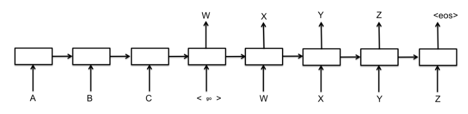
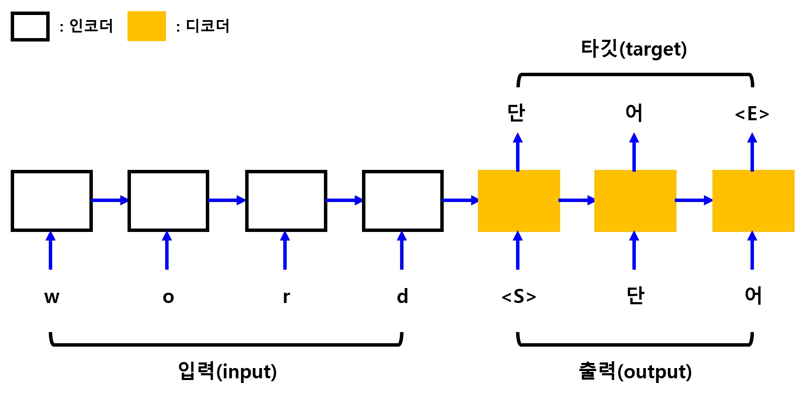

# CHAPTER 10 RNN
## 목차
1. [MNIST를 RNN으로](#MNIST를-RNN으로)<br>
2. [단어 자동 완성](#단어-자동-완성)<br>
3. [Sequence to Sequence](#Sequence-to-Sequence)<br><br>

### 서론
RNN(Recurrent Neural Network, 순환 신경망)은 자연어 인식에서 많이 사용되는 신경망으로, 순서가 있는 데이터를 처리하는데 유리하다. 순서가 있는 데이터라는 것을 알기 쉽게 예시로 들어보면, '와.. 정말 멋지다'와 '음.. 정말 멋지다' 두 문장은 뒷부분은 같지만 앞에 붙는 감탄사에 따라 의미가 정 반대로 달라지므로, 앞에 있는 단어에 따라 뒷부분의 해석이 달라지는 것을 들 수 있다. 자연어 처리라는 말에서 알 수 있듯, 요즘 많이 사용되는 인공지능 스피커(비서), 번역, 챗봇 등 다양 분야에서 쓰이는 것 같다. 종범오빠의 의견을 떠올려보면 RNN등 자연어 처리를 위한 신경망에 대해 더 자세히 공부하기 위해서는 밑바닥부터 시작하는 딥러닝2를 통해 공부하는 것이 좋다.

### MNIST를 RNN으로
<br>
RNN에서 한 덩어리의 신경망을 '셀(Cell)'이라고 하는데, 이 셀들을 여러 개 중첩하여 심층 신경망을 만든다고 한다. 즉, 그림에서 보는 것 처럼 하나의 심층신경망은 여러 셀들이 차례차례 연결되어있는 구조이다. 따라서 앞 단계의 학습 결과가 다음 단계의 학습에 이용되기 때문에 학습 데이터를 단계별로 구분하여 입력해주어야 한다. MINIST 이미지를 예시로 들자면 위에서부터 한줄씩 나누어 데이터를 입력하고 각 셀들은 각 줄의 학습을 맡고, 그 결과들이 연결되어 하나의 심층 신경망, 즉 이미지 하나의 전체 학습 결과가 되는 것이다.<br>


```python
# 머신러닝 학습의 Hello World 와 같은 MNIST(손글씨 숫자 인식) 문제를 신경망으로 풀어봅니다.
import tensorflow.compat.v1 as tf
tf.disable_v2_behavior()

from tensorflow.examples.tutorials.mnist import input_data
mnist = input_data.read_data_sets("./mnist/data/", one_hot=True)

#########
# 옵션 설정
######
learning_rate = 0.001
total_epoch = 30
batch_size = 128

# RNN 은 순서가 있는 자료를 다루므로,
# 한 번에 입력받는 갯수와, 총 몇 단계로 이루어져있는 데이터를 받을지를 설정해야합니다.
# 이를 위해 가로 픽셀수를 n_input 으로, 세로 픽셀수를 입력 단계인 n_step 으로 설정하였습니다.
n_input = 28
n_step = 28
n_hidden = 128
n_class = 10
```

    WARNING:tensorflow:From c:\users\infinite\appdata\local\programs\python\python37\lib\site-packages\tensorflow_core\python\compat\v2_compat.py:65: disable_resource_variables (from tensorflow.python.ops.variable_scope) is deprecated and will be removed in a future version.
    Instructions for updating:
    non-resource variables are not supported in the long term
    WARNING:tensorflow:From <ipython-input-5-2e2ba212ac1b>:6: read_data_sets (from tensorflow.examples.tutorials.mnist.input_data) is deprecated and will be removed in a future version.
    Instructions for updating:
    Please use alternatives such as: tensorflow_datasets.load('mnist')
    WARNING:tensorflow:From c:\users\infinite\appdata\local\programs\python\python37\lib\site-packages\tensorflow_core\examples\tutorials\mnist\input_data.py:297: _maybe_download (from tensorflow.examples.tutorials.mnist.input_data) is deprecated and will be removed in a future version.
    Instructions for updating:
    Please write your own downloading logic.
    WARNING:tensorflow:From c:\users\infinite\appdata\local\programs\python\python37\lib\site-packages\tensorflow_core\examples\tutorials\mnist\input_data.py:299: _extract_images (from tensorflow.examples.tutorials.mnist.input_data) is deprecated and will be removed in a future version.
    Instructions for updating:
    Please use tf.data to implement this functionality.
    Extracting ./mnist/data/train-images-idx3-ubyte.gz
    WARNING:tensorflow:From c:\users\infinite\appdata\local\programs\python\python37\lib\site-packages\tensorflow_core\examples\tutorials\mnist\input_data.py:304: _extract_labels (from tensorflow.examples.tutorials.mnist.input_data) is deprecated and will be removed in a future version.
    Instructions for updating:
    Please use tf.data to implement this functionality.
    Extracting ./mnist/data/train-labels-idx1-ubyte.gz
    WARNING:tensorflow:From c:\users\infinite\appdata\local\programs\python\python37\lib\site-packages\tensorflow_core\examples\tutorials\mnist\input_data.py:112: _dense_to_one_hot (from tensorflow.examples.tutorials.mnist.input_data) is deprecated and will be removed in a future version.
    Instructions for updating:
    Please use tf.one_hot on tensors.
    Extracting ./mnist/data/t10k-images-idx3-ubyte.gz
    Extracting ./mnist/data/t10k-labels-idx1-ubyte.gz
    WARNING:tensorflow:From c:\users\infinite\appdata\local\programs\python\python37\lib\site-packages\tensorflow_core\examples\tutorials\mnist\input_data.py:328: _DataSet.__init__ (from tensorflow.examples.tutorials.mnist.input_data) is deprecated and will be removed in a future version.
    Instructions for updating:
    Please use alternatives such as official/mnist/_DataSet.py from tensorflow/models.
    

n_step으로 몇 단계로 이루어진 데이터를 받을지 설정해주었다. 따라서 하나의 셀에서 다루는 총 데이터의 크기인 n_input은 가로픽셀의 수가 되고, 전체 단계의 수인 n_step은 세로 픽셀의 수가 된다. 우리는 28x28픽셀을 다루기 때문에 두 파라미터값 모두 28을 갖는다.<br>
입력값 X에 전체 단계수 n_step이라는 차원을 추가해 단계별로 나누어 데이터를 입력할 수 있도록 해준다.


```python
#########
# 신경망 모델 구성
######
X = tf.placeholder(tf.float32, [None, n_step, n_input])
Y = tf.placeholder(tf.float32, [None, n_class])

W = tf.Variable(tf.random_normal([n_hidden, n_class]))
b = tf.Variable(tf.random_normal([n_class]))
```

RNN은 긴 단계의 데이터를 사용할 경우 맨 뒤에 가장 앞의 정보가 잘 전달이 되지 않는 특성이 있다. 이는 심층신경망에 대해 공부할 때 나왔던 다양한 방법 중 하나에서 등장했던 문제점이다. 이를 보완하는 다양한 구조 중 LSTM(Long Short-Term Memory)과 GRU(Gated Recurrent Units)가 있다고 한다. 본래 RNN을 직접 구현하려면 매우 힘들고 괴로운 과정을 거쳐야 했겠지만.. 우리에게는 선조의 지식이 있으니 만들어진 툴을 잘 사용하도록 하자!


```python
# RNN 에 학습에 사용할 셀을 생성합니다
# 다음 함수들을 사용하면 다른 구조의 셀로 간단하게 변경할 수 있습니다
# BasicRNNCell,BasicLSTMCell,GRUCell
cell = tf.nn.rnn_cell.BasicRNNCell(n_hidden)
```

    WARNING:tensorflow:From <ipython-input-3-d7b187304934>:4: BasicRNNCell.__init__ (from tensorflow.python.ops.rnn_cell_impl) is deprecated and will be removed in a future version.
    Instructions for updating:
    This class is equivalent as tf.keras.layers.SimpleRNNCell, and will be replaced by that in Tensorflow 2.0.
    

RNN 신경망 생성은 (생성한 RNN 셀, 입력값, 입력값의 자료형)을 넣어주면 알아서 잘 만들어준다.


```python
# RNN 신경망을 생성합니다
# 원래는 다음과 같은 과정을 거쳐야 하지만
# states = tf.zeros(batch_size)
# for i in range(n_step):
#     outputs, states = cell(X[[:, i]], states)
# ...
# 다음처럼 tf.nn.dynamic_rnn 함수를 사용하면
# CNN 의 tf.nn.conv2d 함수처럼 간단하게 RNN 신경망을 만들어줍니다.
# 겁나 매직!!
outputs, states = tf.nn.dynamic_rnn(cell, X, dtype=tf.float32)
```

    WARNING:tensorflow:From <ipython-input-4-c3a33c46bbd0>:10: dynamic_rnn (from tensorflow.python.ops.rnn) is deprecated and will be removed in a future version.
    Instructions for updating:
    Please use `keras.layers.RNN(cell)`, which is equivalent to this API
    WARNING:tensorflow:From c:\users\infinite\appdata\local\programs\python\python37\lib\site-packages\tensorflow_core\python\ops\rnn_cell_impl.py:456: Layer.add_variable (from tensorflow.python.keras.engine.base_layer) is deprecated and will be removed in a future version.
    Instructions for updating:
    Please use `layer.add_weight` method instead.
    WARNING:tensorflow:From c:\users\infinite\appdata\local\programs\python\python37\lib\site-packages\tensorflow_core\python\ops\rnn_cell_impl.py:460: calling Zeros.__init__ (from tensorflow.python.ops.init_ops) with dtype is deprecated and will be removed in a future version.
    Instructions for updating:
    Call initializer instance with the dtype argument instead of passing it to the constructor
    


```python
# 결과를 Y의 다음 형식과 바꿔야 하기 때문에
# Y : [batch_size, n_class]
# outputs 의 형태를 이에 맞춰 변경해야합니다.
# outputs : [batch_size, n_step, n_hidden]
#        -> [n_step, batch_size, n_hidden]
#        -> [batch_size, n_hidden]
outputs = tf.transpose(outputs, [1, 0, 2])
outputs = outputs[-1]
model = tf.matmul(outputs, W) + b
```

손실함수는 결괏값을 원-핫 인코딩 형태로 만들기 위해 tf.nn.softmax_cross_entropy_with_logits를 사용한다. 이를 위해 최종 결과가 실측값 Y와 동일한 형태여야 하므로 이를 위한 가중치와 편향값을 잘 설정해주었으나 RNN신경망에서 나오는 출력값은 각 단계가 포함된 3차원 행렬값으로 나온다. 따라서 이 출력값을 가중치 W와 같은 형태로 만들어 행렬곱을 수행하여 원하는 출력값을 얻어내야 한다. 이 때 dynaic_rnn 옵션 중 time_major=True로 하면 [n_step, batch_size, n_hidden]형태로 출력되고, 그렇지 않으면 [batch_size, n_step, n_hidden]형태로 출력된다고 하여 time_major를 True로 하고 출력된 형태를 print하고, 그렇지 않았을 때의 형태를 print해보았지만 shape가 같았다. 그래서 열심히 구글링을 해봤는데,, 다들 골빈해커님과 같은 말씀을 하실 뿐이라 왜 이렇게 나오는지 잘 모르겠다.


```python
outputs, states = tf.nn.dynamic_rnn(cell, X, dtype=tf.float32, time_major=True)
print(outputs)
outputs, states = tf.nn.dynamic_rnn(cell, X, dtype=tf.float32)
print(outputs)
```

    Tensor("rnn_7/TensorArrayStack/TensorArrayGatherV3:0", shape=(?, 28, 128), dtype=float32)
    Tensor("rnn_8/transpose_1:0", shape=(?, 28, 128), dtype=float32)
    

입력값을 형태에 맞게 변환하는 부분만 주의하면 나머지는 평소와 비슷한 형태이다.


```python
cost = tf.reduce_mean(tf.nn.softmax_cross_entropy_with_logits_v2(logits=model, labels=Y))
optimizer = tf.train.AdamOptimizer(learning_rate).minimize(cost)

#########
# 신경망 모델 학습
######
sess = tf.Session()
sess.run(tf.global_variables_initializer())

total_batch = int(mnist.train.num_examples/batch_size)

for epoch in range(total_epoch):
    total_cost = 0

    for i in range(total_batch):
        batch_xs, batch_ys = mnist.train.next_batch(batch_size)
        # X 데이터를 RNN 입력 데이터에 맞게 [batch_size, n_step, n_input] 형태로 변환합니다.
        batch_xs = batch_xs.reshape((batch_size, n_step, n_input))

        _, cost_val = sess.run([optimizer, cost],
                               feed_dict={X: batch_xs, Y: batch_ys})
        total_cost += cost_val

    print('Epoch:', '%04d' % (epoch + 1),
          'Avg. cost =', '{:.3f}'.format(total_cost / total_batch))

print('최적화 완료!')
```

    Epoch: 0001 Avg. cost = 0.532
    Epoch: 0002 Avg. cost = 0.229
    Epoch: 0003 Avg. cost = 0.181
    Epoch: 0004 Avg. cost = 0.153
    Epoch: 0005 Avg. cost = 0.132
    Epoch: 0006 Avg. cost = 0.121
    Epoch: 0007 Avg. cost = 0.113
    Epoch: 0008 Avg. cost = 0.108
    Epoch: 0009 Avg. cost = 0.106
    Epoch: 0010 Avg. cost = 0.100
    Epoch: 0011 Avg. cost = 0.097
    Epoch: 0012 Avg. cost = 0.088
    Epoch: 0013 Avg. cost = 0.086
    Epoch: 0014 Avg. cost = 0.078
    Epoch: 0015 Avg. cost = 0.079
    Epoch: 0016 Avg. cost = 0.084
    Epoch: 0017 Avg. cost = 0.081
    Epoch: 0018 Avg. cost = 0.080
    Epoch: 0019 Avg. cost = 0.076
    Epoch: 0020 Avg. cost = 0.070
    Epoch: 0021 Avg. cost = 0.068
    Epoch: 0022 Avg. cost = 0.072
    Epoch: 0023 Avg. cost = 0.073
    Epoch: 0024 Avg. cost = 0.064
    Epoch: 0025 Avg. cost = 0.066
    Epoch: 0026 Avg. cost = 0.064
    Epoch: 0027 Avg. cost = 0.061
    Epoch: 0028 Avg. cost = 0.062
    Epoch: 0029 Avg. cost = 0.062
    Epoch: 0030 Avg. cost = 0.060
    최적화 완료!
    


```python
#########
# 결과 확인
######
is_correct = tf.equal(tf.argmax(model, 1), tf.argmax(Y, 1))
accuracy = tf.reduce_mean(tf.cast(is_correct, tf.float32))

test_batch_size = len(mnist.test.images)
test_xs = mnist.test.images.reshape(test_batch_size, n_step, n_input)
test_ys = mnist.test.labels

print('정확도:', sess.run(accuracy,
                       feed_dict={X: test_xs, Y: test_ys}))
```

    정확도: 0.9713
    

### 단어 자동 완성
RNN에서는 sequence_length옵션을 사용해 가변 길이 단어를 학습시킬 수 있으나, 여기서는 간단한 예제를 학습하기 위해 고정 길이 단어를 다루는 단어 자동완성 프로그램을 만들어본다. 각 글자는 하나의 단계를 의미하며, 총 3글자가 주어지면 나머지 하나의 글자를 추천하므로 3개의 셀로 이루어진 간단한 RNN모델을 만들면 된다.<br>
<br>
여기서는 간단한 소문자의 처리에 연관 배열을 사용했다. 짧게 본다면 그냥 간단히 다른 방법을 사용해도 되지 않나? 하는 생각이 들겠지만 이를 조금만 응용하여 생각한다면 연관배열을 만들어서 사용하는 코딩의 중요성을 생각할 수 있다. 모든 기본은 응용의 기초가 되는것이므로! 깔끔하고 원할한 코딩을 위해 생활화하도록 하자.


```python
import numpy as np

# 자연어 처리나 음성 처리 분야에 많이 사용되는 RNN 의 기본적인 사용법을 익힙니다.
# 4개의 글자를 가진 단어를 학습시켜, 3글자만 주어지면 나머지 한 글자를 추천하여 단어를 완성하는 프로그램입니다.

char_arr = ['a', 'b', 'c', 'd', 'e', 'f', 'g',
            'h', 'i', 'j', 'k', 'l', 'm', 'n',
            'o', 'p', 'q', 'r', 's', 't', 'u',
            'v', 'w', 'x', 'y', 'z']

# one-hot 인코딩 사용 및 디코딩을 하기 위해 연관 배열을 만듭니다.
# {'a': 0, 'b': 1, 'c': 2, ..., 'j': 9, 'k', 10, ...}
num_dic = {n: i for i, n in enumerate(char_arr)}
dic_len = len(num_dic)

# 다음 배열은 입력값과 출력값으로 다음처럼 사용할 것 입니다.
# wor -> X, d -> Y
# woo -> X, d -> Y
seq_data = ['word', 'wood', 'deep', 'dive', 'cold', 'cool', 'load', 'love', 'kiss', 'kind']
```

내가 어려워하던 개념을 어느정도 알 것 같게 하는 문장이다.
```python
input = [num_dic[n] for n in seq[:-1]]
```
처음부터 마지막 바로 전까지의 부분배열을 각각 저장한다.
부분배열에 대해서는,, 잘 익혀두었으면 좋겠다!!<br>
실측값은 원-핫 인코딩 하지 않고 그대로 사용하며, 그렇기 때문에 손실함수는 sparse를 사용한다. 이 함수는 labels값에 원-핫 인코딩을 사용하지 않아도 자동으로 변환하여 계산해준다고 한다.


```python
def make_batch(seq_data):
    input_batch = []
    target_batch = []

    for seq in seq_data:
        # 여기서 생성하는 input_batch 와 target_batch 는
        # 알파벳 배열의 인덱스 번호 입니다.
        # [22, 14, 17] [22, 14, 14] [3, 4, 4] [3, 8, 21] ...
        input = [num_dic[n] for n in seq[:-1]]
        # 3, 3, 15, 4, 3 ...
        target = num_dic[seq[-1]]
        # one-hot 인코딩을 합니다.
        # if input is [0, 1, 2]:
        # [[ 1.  0.  0.  0.  0.  0.  0.  0.  0.  0.]
        #  [ 0.  1.  0.  0.  0.  0.  0.  0.  0.  0.]
        #  [ 0.  0.  1.  0.  0.  0.  0.  0.  0.  0.]]
        input_batch.append(np.eye(dic_len)[input])
        # 지금까지 손실함수로 사용하던 softmax_cross_entropy_with_logits 함수는
        # label 값을 one-hot 인코딩으로 넘겨줘야 하지만,
        # 이 예제에서 사용할 손실 함수인 sparse_softmax_cross_entropy_with_logits 는
        # one-hot 인코딩을 사용하지 않으므로 index 를 그냥 넘겨주면 됩니다.
        target_batch.append(target)

    return input_batch, target_batch
```

원-핫 인코딩이기 때문에 알파벳 글자들의 배열 크기와 입-출력값이 같다. 따라서 손실함수 사용시 실측값인 labels값은 인덱스의 숫자를 그대로 사용하지만, 출력값은 원-핫 인코딩을 사용한다.


```python
#########
# 옵션 설정
######
learning_rate = 0.01
n_hidden = 128
total_epoch = 30
# 타입 스텝: [1 2 3] => 3
# RNN 을 구성하는 시퀀스의 갯수입니다.
n_step = 3
# 입력값 크기. 알파벳에 대한 one-hot 인코딩이므로 26개가 됩니다.
# 예) c => [0 0 1 0 0 0 0 0 0 0 0 ... 0]
# 출력값도 입력값과 마찬가지로 26개의 알파벳으로 분류합니다.
n_input = n_class = dic_len
```


```python
#########
# 신경망 모델 구성
######
X = tf.placeholder(tf.float32, [None, n_step, n_input])
# 비용함수에 sparse_softmax_cross_entropy_with_logits 을 사용하므로
# 출력값과의 계산을 위한 원본값의 형태는 one-hot vector가 아니라 인덱스 숫자를 그대로 사용하기 때문에
# 다음처럼 하나의 값만 있는 1차원 배열을 입력값으로 받습니다.
# [3] [3] [15] [4] ...
# 기존처럼 one-hot 인코딩을 사용한다면 입력값의 형태는 [None, n_class] 여야합니다.
Y = tf.placeholder(tf.int32, [None])

W = tf.Variable(tf.random_normal([n_hidden, n_class]))
b = tf.Variable(tf.random_normal([n_class]))
```


```python
# RNN 셀을 생성합니다.
cell1 = tf.nn.rnn_cell.BasicLSTMCell(n_hidden)
# 과적합 방지를 위한 Dropout 기법을 사용합니다.
cell1 = tf.nn.rnn_cell.DropoutWrapper(cell1, output_keep_prob=0.5)
# 여러개의 셀을 조합해서 사용하기 위해 셀을 추가로 생성합니다.
cell2 = tf.nn.rnn_cell.BasicLSTMCell(n_hidden)

# 여러개의 셀을 조합한 RNN 셀을 생성합니다.
multi_cell = tf.nn.rnn_cell.MultiRNNCell([cell1, cell2])
```

    WARNING:tensorflow:From <ipython-input-15-6f47549ee1c8>:2: BasicLSTMCell.__init__ (from tensorflow.python.ops.rnn_cell_impl) is deprecated and will be removed in a future version.
    Instructions for updating:
    This class is equivalent as tf.keras.layers.LSTMCell, and will be replaced by that in Tensorflow 2.0.
    WARNING:tensorflow:From <ipython-input-15-6f47549ee1c8>:9: MultiRNNCell.__init__ (from tensorflow.python.ops.rnn_cell_impl) is deprecated and will be removed in a future version.
    Instructions for updating:
    This class is equivalent as tf.keras.layers.StackedRNNCells, and will be replaced by that in Tensorflow 2.0.
    


```python
# tf.nn.dynamic_rnn 함수를 이용해 순환 신경망을 만듭니다.
# time_major=True
outputs, states = tf.nn.dynamic_rnn(multi_cell, X, dtype=tf.float32)

# 최종 결과는 one-hot 인코딩 형식으로 만듭니다
outputs = tf.transpose(outputs, [1, 0, 2])
outputs = outputs[-1]
model = tf.matmul(outputs, W) + b
```

make_batch()를 통해 원래 주어졌던 단어를 첫 3글자(입력값)와 마지막 한 글자(실측값)으로 분리하고, 이를 최적화를 실행하는 함수에 각각 넣어주었다.


```python
cost = tf.reduce_mean(
            tf.nn.sparse_softmax_cross_entropy_with_logits(
                logits=model, labels=Y))

optimizer = tf.train.AdamOptimizer(learning_rate).minimize(cost)

#########
# 신경망 모델 학습
######
sess = tf.Session()
sess.run(tf.global_variables_initializer())

input_batch, target_batch = make_batch(seq_data)

for epoch in range(total_epoch):
    _, loss = sess.run([optimizer, cost],
                       feed_dict={X: input_batch, Y: target_batch})

    print('Epoch:', '%04d' % (epoch + 1),
          'cost =', '{:.6f}'.format(loss))

print('최적화 완료!')

#########
# 결과 확인
######
# 레이블값이 정수이므로 예측값도 정수로 변경해줍니다.
prediction = tf.cast(tf.argmax(model, 1), tf.int32)
# one-hot 인코딩이 아니므로 입력값을 그대로 비교합니다.
prediction_check = tf.equal(prediction, Y)
accuracy = tf.reduce_mean(tf.cast(prediction_check, tf.float32))

input_batch, target_batch = make_batch(seq_data)

predict, accuracy_val = sess.run([prediction, accuracy],
                                 feed_dict={X: input_batch, Y: target_batch})

predict_words = []
for idx, val in enumerate(seq_data):
    last_char = char_arr[predict[idx]]
    predict_words.append(val[:3] + last_char)

print('\n=== 예측 결과 ===')
print('입력값:', [w[:3] + ' ' for w in seq_data])
print('예측값:', predict_words)
print('정확도:', accuracy_val)
```

    Epoch: 0001 cost = 3.293734
    Epoch: 0002 cost = 2.337015
    Epoch: 0003 cost = 1.653457
    Epoch: 0004 cost = 1.009791
    Epoch: 0005 cost = 0.893463
    Epoch: 0006 cost = 0.687594
    Epoch: 0007 cost = 0.403785
    Epoch: 0008 cost = 0.596801
    Epoch: 0009 cost = 0.291392
    Epoch: 0010 cost = 0.584484
    Epoch: 0011 cost = 0.237718
    Epoch: 0012 cost = 0.083843
    Epoch: 0013 cost = 0.187949
    Epoch: 0014 cost = 0.171352
    Epoch: 0015 cost = 0.183575
    Epoch: 0016 cost = 0.090578
    Epoch: 0017 cost = 0.065672
    Epoch: 0018 cost = 0.055899
    Epoch: 0019 cost = 0.190207
    Epoch: 0020 cost = 0.068897
    Epoch: 0021 cost = 0.121441
    Epoch: 0022 cost = 0.095726
    Epoch: 0023 cost = 0.016210
    Epoch: 0024 cost = 0.039880
    Epoch: 0025 cost = 0.026157
    Epoch: 0026 cost = 0.014177
    Epoch: 0027 cost = 0.015498
    Epoch: 0028 cost = 0.014349
    Epoch: 0029 cost = 0.019394
    Epoch: 0030 cost = 0.002970
    최적화 완료!
    
    === 예측 결과 ===
    입력값: ['wor ', 'woo ', 'dee ', 'div ', 'col ', 'coo ', 'loa ', 'lov ', 'kis ', 'kin ']
    예측값: ['word', 'wood', 'deep', 'dive', 'cold', 'cool', 'load', 'love', 'kiss', 'kind']
    정확도: 1.0
    

### Sequence to Sequence
Sequence to Sequence(Seq2Seq)는 구글이 기계 번역에 사용하는 신경망 모델이다. RNN과 출력 신경망을 조합하여 문장을 입력받아 다른 문장을 출력하는 프로그램에서 많이 사용한다.<br>
<br>
크게 입력에 사용되는 신경망인 인코더와 출력에 사용되는 신경망인 디코더로 구성된다.<br>
우리는 네글자의 영단어를 받아 두 글자의 한글로 번역하는 프로그램을 만들 것인데, 아마도 10.2에서와 마찬가지로 가변길이 모델을 사용할 경우에 신경써야 할 것이 많으므로 일단 고정 길이 단어만을 사용하는 모델을 만들어 보는 것이라 생각된다.<br>
<br>
여기서 중요한 것은 디코더의 입력 시작을 알리는 심볼, 그리고 디코더의 출력이 끝남을 알리는 심볼, 빈 데이터에 사용하는 의미 없는 심볼 세가지가 필요하다. 여기서는 'S', 'E', 'P'로 처리한다.


```python
import tensorflow.compat.v1 as tf
tf.disable_v2_behavior()
import numpy as np
```

    WARNING:tensorflow:From c:\users\infinite\appdata\local\programs\python\python37\lib\site-packages\tensorflow_core\python\compat\v2_compat.py:65: disable_resource_variables (from tensorflow.python.ops.variable_scope) is deprecated and will be removed in a future version.
    Instructions for updating:
    non-resource variables are not supported in the long term
    

char_arr는 심볼, 영어 알파벳, 한글들이 각각 한글자 씩 이루어진 배열이다.
num_dic을 통해 연관배열을 만들어두었다.


```python
# 챗봇, 번역, 이미지 캡셔닝등에 사용되는 시퀀스 학습/생성 모델인 Seq2Seq 을 구현해봅니다.
# 영어 단어를 한국어 단어로 번역하는 프로그램을 만들어봅니다.

# S: 디코딩 입력의 시작을 나타내는 심볼
# E: 디코딩 출력을 끝을 나타내는 심볼
# P: 현재 배치 데이터의 time step 크기보다 작은 경우 빈 시퀀스를 채우는 심볼
#    예) 현재 배치 데이터의 최대 크기가 4 인 경우
#       word -> ['w', 'o', 'r', 'd']
#       to   -> ['t', 'o', 'P', 'P']
char_arr = [c for c in 'SEPabcdefghijklmnopqrstuvwxyz단어나무놀이소녀키스사랑']
num_dic = {n: i for i, n in enumerate(char_arr)}
dic_len = len(num_dic)

# 영어를 한글로 번역하기 위한 학습 데이터
seq_data = [['word', '단어'], ['wood', '나무'],
            ['game', '놀이'], ['girl', '소녀'],
            ['kiss', '키스'], ['love', '사랑']]
```

인코더 셀은 그냥 단어가 한 글자씩 떨어져있는 배열을 입력값으로 넣어준다.<br>
디코더 셀의 입력값을 줄 때는 가장 앞에 시작을 나타내는 심볼값을 붙여주고 넣어주어야 한다!<br>
출력값 또한 출력을 한 이후 마지막에 끝을 알리는 심볼값을 붙여준다.<br>
이렇게 만들어진 데이터를 원-핫인코딩을 하는데, 손실함수로 sparse를 사용하기 때문에 디코더 셀의 출력값만 원-핫 인코딩이 아닌 인덱스 그대로를 사용한다.<br>
np.eye(dic_len)[input]은 dic_len의 input번째 인덱스에 해당하는 열을.. 가져오는 것으로 보인다..[참고](https://stackoverflow.com/questions/46126914/what-does-np-eyennparray-mean)


```python
def make_batch(seq_data):
    input_batch = []
    output_batch = []
    target_batch = []

    for seq in seq_data:
        # 인코더 셀의 입력값. 입력단어의 글자들을 한글자씩 떼어 배열로 만든다.
        input = [num_dic[n] for n in seq[0]]
        # 디코더 셀의 입력값. 시작을 나타내는 S 심볼을 맨 앞에 붙여준다.
        output = [num_dic[n] for n in ('S' + seq[1])]
        # 학습을 위해 비교할 디코더 셀의 출력값. 끝나는 것을 알려주기 위해 마지막에 E 를 붙인다.
        target = [num_dic[n] for n in (seq[1] + 'E')]
        input_batch.append(np.eye(dic_len)[input])
        output_batch.append(np.eye(dic_len)[output])
        # 출력값만 one-hot 인코딩이 아님 (sparse_softmax_cross_entropy_with_logits 사용)
        target_batch.append(target)

    return input_batch, output_batch, target_batch
```


```python
#########
# 옵션 설정
######
learning_rate = 0.01
n_hidden = 128
total_epoch = 100
# 입력과 출력의 형태가 one-hot 인코딩으로 같으므로 크기도 같다.
n_class = n_input = dic_len
```

디코더의 출력값은 원-핫 인코딩이 아니므로 차원 수가 하나 적다. 앞에서 했던 10.2와 비슷한 느낌이 든다.<br>
가변길이 단어를 넣을 때에도 같은 배치에 입력되는 데이터는 글자수(단계수, time steps)가 모두 동일해야 한다는 점에 주의하라.<br>
따라서 가장 긴 단어의 길이에 맞춰 짧은 단어에는 의미없는 값으로 채워 사용해야 한다.


```python
#########
# 신경망 모델 구성
######
# Seq2Seq 모델은 인코더의 입력과 디코더의 입력의 형식이 같다.
# [batch size, time steps, input size]
enc_input = tf.placeholder(tf.float32, [None, None, n_input])
dec_input = tf.placeholder(tf.float32, [None, None, n_input])
# [batch size, time steps]
targets = tf.placeholder(tf.int64, [None, None])
```

셀은 기본 RNNcell을 사용하고, 드롭아웃을 적용했다.


```python
# 인코더 셀을 구성한다.
with tf.variable_scope('encode'):
    enc_cell = tf.nn.rnn_cell.BasicRNNCell(n_hidden)
    enc_cell = tf.nn.rnn_cell.DropoutWrapper(enc_cell, output_keep_prob=0.5)

    outputs, enc_states = tf.nn.dynamic_rnn(enc_cell, enc_input,
                                            dtype=tf.float32)
```

    WARNING:tensorflow:From <ipython-input-6-3df553f12afd>:3: BasicRNNCell.__init__ (from tensorflow.python.ops.rnn_cell_impl) is deprecated and will be removed in a future version.
    Instructions for updating:
    This class is equivalent as tf.keras.layers.SimpleRNNCell, and will be replaced by that in Tensorflow 2.0.
    WARNING:tensorflow:From <ipython-input-6-3df553f12afd>:7: dynamic_rnn (from tensorflow.python.ops.rnn) is deprecated and will be removed in a future version.
    Instructions for updating:
    Please use `keras.layers.RNN(cell)`, which is equivalent to this API
    WARNING:tensorflow:From c:\users\infinite\appdata\local\programs\python\python37\lib\site-packages\tensorflow_core\python\ops\rnn_cell_impl.py:456: Layer.add_variable (from tensorflow.python.keras.engine.base_layer) is deprecated and will be removed in a future version.
    Instructions for updating:
    Please use `layer.add_weight` method instead.
    WARNING:tensorflow:From c:\users\infinite\appdata\local\programs\python\python37\lib\site-packages\tensorflow_core\python\ops\rnn_cell_impl.py:460: calling Zeros.__init__ (from tensorflow.python.ops.init_ops) with dtype is deprecated and will be removed in a future version.
    Instructions for updating:
    Call initializer instance with the dtype argument instead of passing it to the constructor
    

디코더의 초기 상태값을 인코더 셀의 최종 상태값으로 넣어주는것이 중요하다. 이는 인코더의 결과값을 디코더로 그대로 전파한다는 것이 핵심 아이디어이기 때문이다.


```python
# 디코더 셀을 구성한다.
with tf.variable_scope('decode'):
    dec_cell = tf.nn.rnn_cell.BasicRNNCell(n_hidden)
    dec_cell = tf.nn.rnn_cell.DropoutWrapper(dec_cell, output_keep_prob=0.5)

    # Seq2Seq 모델은 인코더 셀의 최종 상태값을
    # 디코더 셀의 초기 상태값으로 넣어주는 것이 핵심.
    outputs, dec_states = tf.nn.dynamic_rnn(dec_cell, dec_input,
                                            initial_state=enc_states,
                                            dtype=tf.float32)
```

고수준 API에서는 가중치와 편향값을 따로 선언하지 않아도 알아서 처리해준다.<br>
출력층으로 layers 모듈의 dense함수를 사용했다.


```python
model = tf.layers.dense(outputs, n_class, activation=None)


cost = tf.reduce_mean(
            tf.nn.sparse_softmax_cross_entropy_with_logits(
                logits=model, labels=targets))

optimizer = tf.train.AdamOptimizer(learning_rate).minimize(cost)
```

    WARNING:tensorflow:From <ipython-input-8-9f079d4ab947>:1: dense (from tensorflow.python.layers.core) is deprecated and will be removed in a future version.
    Instructions for updating:
    Use keras.layers.Dense instead.
    WARNING:tensorflow:From c:\users\infinite\appdata\local\programs\python\python37\lib\site-packages\tensorflow_core\python\layers\core.py:187: Layer.apply (from tensorflow.python.keras.engine.base_layer) is deprecated and will be removed in a future version.
    Instructions for updating:
    Please use `layer.__call__` method instead.
    


```python
#########
# 신경망 모델 학습
######
sess = tf.Session()
sess.run(tf.global_variables_initializer())

input_batch, output_batch, target_batch = make_batch(seq_data)

for epoch in range(total_epoch):
    _, loss = sess.run([optimizer, cost],
                       feed_dict={enc_input: input_batch,
                                  dec_input: output_batch,
                                  targets: target_batch})

    print('Epoch:', '%04d' % (epoch + 1),
          'cost =', '{:.6f}'.format(loss))

print('최적화 완료!')
```

    Epoch: 0001 cost = 3.674479
    Epoch: 0002 cost = 2.479297
    Epoch: 0003 cost = 1.520522
    Epoch: 0004 cost = 1.038995
    Epoch: 0005 cost = 0.582069
    Epoch: 0006 cost = 0.366857
    Epoch: 0007 cost = 0.556101
    Epoch: 0008 cost = 0.325730
    Epoch: 0009 cost = 0.356730
    Epoch: 0010 cost = 0.264025
    Epoch: 0011 cost = 0.156761
    Epoch: 0012 cost = 0.259366
    Epoch: 0013 cost = 0.093891
    Epoch: 0014 cost = 0.129076
    Epoch: 0015 cost = 0.073512
    Epoch: 0016 cost = 0.089568
    Epoch: 0017 cost = 0.031112
    Epoch: 0018 cost = 0.161636
    Epoch: 0019 cost = 0.205166
    Epoch: 0020 cost = 0.072264
    Epoch: 0021 cost = 0.055341
    Epoch: 0022 cost = 0.239943
    Epoch: 0023 cost = 0.115363
    Epoch: 0024 cost = 0.015077
    Epoch: 0025 cost = 0.011432
    Epoch: 0026 cost = 0.060616
    Epoch: 0027 cost = 0.015219
    Epoch: 0028 cost = 0.030512
    Epoch: 0029 cost = 0.134052
    Epoch: 0030 cost = 0.025838
    Epoch: 0031 cost = 0.071431
    Epoch: 0032 cost = 0.017080
    Epoch: 0033 cost = 0.075347
    Epoch: 0034 cost = 0.027607
    Epoch: 0035 cost = 0.018805
    Epoch: 0036 cost = 0.008196
    Epoch: 0037 cost = 0.002217
    Epoch: 0038 cost = 0.004628
    Epoch: 0039 cost = 0.009572
    Epoch: 0040 cost = 0.010713
    Epoch: 0041 cost = 0.009346
    Epoch: 0042 cost = 0.014441
    Epoch: 0043 cost = 0.005560
    Epoch: 0044 cost = 0.003078
    Epoch: 0045 cost = 0.011448
    Epoch: 0046 cost = 0.002706
    Epoch: 0047 cost = 0.002102
    Epoch: 0048 cost = 0.009892
    Epoch: 0049 cost = 0.004104
    Epoch: 0050 cost = 0.014104
    Epoch: 0051 cost = 0.001953
    Epoch: 0052 cost = 0.001580
    Epoch: 0053 cost = 0.003825
    Epoch: 0054 cost = 0.001264
    Epoch: 0055 cost = 0.002244
    Epoch: 0056 cost = 0.000938
    Epoch: 0057 cost = 0.001309
    Epoch: 0058 cost = 0.000429
    Epoch: 0059 cost = 0.001979
    Epoch: 0060 cost = 0.004742
    Epoch: 0061 cost = 0.001362
    Epoch: 0062 cost = 0.001257
    Epoch: 0063 cost = 0.006353
    Epoch: 0064 cost = 0.002859
    Epoch: 0065 cost = 0.001253
    Epoch: 0066 cost = 0.000782
    Epoch: 0067 cost = 0.000870
    Epoch: 0068 cost = 0.000351
    Epoch: 0069 cost = 0.001823
    Epoch: 0070 cost = 0.002253
    Epoch: 0071 cost = 0.001991
    Epoch: 0072 cost = 0.001414
    Epoch: 0073 cost = 0.000698
    Epoch: 0074 cost = 0.001754
    Epoch: 0075 cost = 0.000239
    Epoch: 0076 cost = 0.000547
    Epoch: 0077 cost = 0.000767
    Epoch: 0078 cost = 0.000414
    Epoch: 0079 cost = 0.000646
    Epoch: 0080 cost = 0.000524
    Epoch: 0081 cost = 0.000327
    Epoch: 0082 cost = 0.001222
    Epoch: 0083 cost = 0.000449
    Epoch: 0084 cost = 0.000613
    Epoch: 0085 cost = 0.000733
    Epoch: 0086 cost = 0.000189
    Epoch: 0087 cost = 0.000902
    Epoch: 0088 cost = 0.001003
    Epoch: 0089 cost = 0.000368
    Epoch: 0090 cost = 0.000957
    Epoch: 0091 cost = 0.000534
    Epoch: 0092 cost = 0.000260
    Epoch: 0093 cost = 0.000188
    Epoch: 0094 cost = 0.000338
    Epoch: 0095 cost = 0.000794
    Epoch: 0096 cost = 0.000504
    Epoch: 0097 cost = 0.000389
    Epoch: 0098 cost = 0.000612
    Epoch: 0099 cost = 0.000274
    Epoch: 0100 cost = 0.000715
    최적화 완료!
    

어려웠던 점은 앞에서는 단어+심볼로 이루어진 3크기의 배열을 사용했는데, 여기서는 'PPPP'가 들어갔으니 5크기의 배열이 만들어졌을 것이라는 점이었다. 그렇지만 input배열의 shape는 [batch size, time steps, input size]인데.. batchsize는 batch만큼 append하므로 괜찮을 것이고, timesteps와 input size는 input배열의 갯수만큼 dic_len길이의 1차원 배열을 붙여준 것일 테니 이렇게 이해하면 되는데..<br>
이렇게 하면 input배열의 갯수와 output배열의 갯수가 서로 일치하지 않은데 괜찮느냐는 의문이 든다. 이건 time steps가 달라지는 것이므로 괜찮은 것이 되는 것 같다.<br>
이를 확인하기 위해 'E'이후를 제거하기 이전의 decoded배열을 출력해보았더니, 내 예상처럼 5크기의 배열이 만들어지는 모습을 볼 수 있었다. 이를 통해 디코더의 입-출력 time_step또한 배열 길이+1이 된다는 것을 알 수 있다.


```python
#########
# 번역 테스트
######
# 단어를 입력받아 번역 단어를 예측하고 디코딩하는 함수
def translate(word):
    # 이 모델은 입력값과 출력값 데이터로 [영어단어, 한글단어] 사용하지만,
    # 예측시에는 한글단어를 알지 못하므로, 디코더의 입출력값을 의미 없는 값인 P 값으로 채운다.
    # ['word', 'PPPP']
    seq_data = [word, 'P' * len(word)]

    input_batch, output_batch, target_batch = make_batch([seq_data])

    # 결과가 [batch size, time step, input] 으로 나오기 때문에,
    # 2번째 차원인 input 차원을 argmax 로 취해 가장 확률이 높은 글자를 예측 값으로 만든다.
    prediction = tf.argmax(model, 2)

    result = sess.run(prediction,
                      feed_dict={enc_input: input_batch,
                                 dec_input: output_batch,
                                 targets: target_batch})

    # 결과 값인 숫자의 인덱스에 해당하는 글자를 가져와 글자 배열을 만든다.
    decoded = [char_arr[i] for i in result[0]]
    print(decoded)

    # 출력의 끝을 의미하는 'E' 이후의 글자들을 제거하고 문자열로 만든다.
    end = decoded.index('E')
    translated = ''.join(decoded[:end])

    return translated


print('\n=== 번역 테스트 ===')

print('word ->', translate('word'))
print('wodr ->', translate('wodr'))
print('love ->', translate('love'))
print('loev ->', translate('loev'))
print('abcd ->', translate('abcd'))
```

    
    === 번역 테스트 ===
    ['단', '어', 'E', '나', 'E']
    word -> 단어
    ['나', '무', 'E', '무', 'E']
    wodr -> 나무
    ['사', '랑', 'E', '나', '무']
    love -> 사랑
    ['사', '랑', 'E', '나', '무']
    loev -> 사랑
    ['소', '녀', 'E', '이', 'E']
    abcd -> 소녀
    
