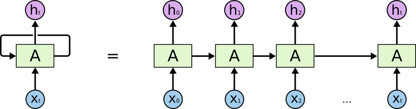
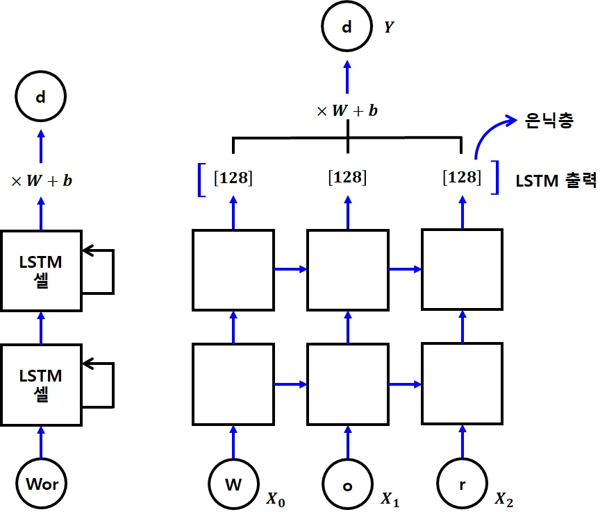

# CHAPTER 10 RNN
## 목차
1. [MNIST를 RNN으로](#MNIST를-RNN으로)<br>
2. [단어 자동 완성](#단어-자동-완성)<br>
3. [Sequence to Sequence](#Sequence-to-Sequence)<br><br>

### 서론
RNN(Recurrent Neural Network, 순환 신경망)은 자연어 인식에서 많이 사용되는 신경망으로, 순서가 있는 데이터를 처리하는데 유리하다. 순서가 있는 데이터라는 것을 알기 쉽게 예시로 들어보면, '와.. 정말 멋지다'와 '음.. 정말 멋지다' 두 문장은 뒷부분은 같지만 앞에 붙는 감탄사에 따라 의미가 정 반대로 달라지므로, 앞에 있는 단어에 따라 뒷부분의 해석이 달라지는 것을 들 수 있다. 자연어 처리라는 말에서 알 수 있듯, 요즘 많이 사용되는 인공지능 스피커(비서), 번역, 챗봇 등 다양 분야에서 쓰이는 것 같다. 종범오빠의 의견을 떠올려보면 RNN등 자연어 처리를 위한 신경망에 대해 더 자세히 공부하기 위해서는 밑바닥부터 시작하는 딥러닝2를 통해 공부하는 것이 좋다.

### MNIST를 RNN으로
<br>
RNN에서 한 덩어리의 신경망을 '셀(Cell)'이라고 하는데, 이 셀들을 여러 개 중첩하여 심층 신경망을 만든다고 한다. 즉, 그림에서 보는 것 처럼 하나의 심층신경망은 여러 셀들이 차례차례 연결되어있는 구조이다. 따라서 앞 단계의 학습 결과가 다음 단계의 학습에 이용되기 때문에 학습 데이터를 단계별로 구분하여 입력해주어야 한다. MINIST 이미지를 예시로 들자면 위에서부터 한줄씩 나누어 데이터를 입력하고 각 셀들은 각 줄의 학습을 맡고, 그 결과들이 연결되어 하나의 심층 신경망, 즉 이미지 하나의 전체 학습 결과가 되는 것이다.<br>


```python
# 머신러닝 학습의 Hello World 와 같은 MNIST(손글씨 숫자 인식) 문제를 신경망으로 풀어봅니다.
import tensorflow.compat.v1 as tf
tf.disable_v2_behavior()

from tensorflow.examples.tutorials.mnist import input_data
mnist = input_data.read_data_sets("./mnist/data/", one_hot=True)

#########
# 옵션 설정
######
learning_rate = 0.001
total_epoch = 30
batch_size = 128

# RNN 은 순서가 있는 자료를 다루므로,
# 한 번에 입력받는 갯수와, 총 몇 단계로 이루어져있는 데이터를 받을지를 설정해야합니다.
# 이를 위해 가로 픽셀수를 n_input 으로, 세로 픽셀수를 입력 단계인 n_step 으로 설정하였습니다.
n_input = 28
n_step = 28
n_hidden = 128
n_class = 10
```

    WARNING:tensorflow:From c:\users\infinite\appdata\local\programs\python\python37\lib\site-packages\tensorflow_core\python\compat\v2_compat.py:65: disable_resource_variables (from tensorflow.python.ops.variable_scope) is deprecated and will be removed in a future version.
    Instructions for updating:
    non-resource variables are not supported in the long term
    WARNING:tensorflow:From <ipython-input-1-2e2ba212ac1b>:6: read_data_sets (from tensorflow.examples.tutorials.mnist.input_data) is deprecated and will be removed in a future version.
    Instructions for updating:
    Please use alternatives such as: tensorflow_datasets.load('mnist')
    WARNING:tensorflow:From c:\users\infinite\appdata\local\programs\python\python37\lib\site-packages\tensorflow_core\examples\tutorials\mnist\input_data.py:297: _maybe_download (from tensorflow.examples.tutorials.mnist.input_data) is deprecated and will be removed in a future version.
    Instructions for updating:
    Please write your own downloading logic.
    WARNING:tensorflow:From c:\users\infinite\appdata\local\programs\python\python37\lib\site-packages\tensorflow_core\examples\tutorials\mnist\input_data.py:299: _extract_images (from tensorflow.examples.tutorials.mnist.input_data) is deprecated and will be removed in a future version.
    Instructions for updating:
    Please use tf.data to implement this functionality.
    Extracting ./mnist/data/train-images-idx3-ubyte.gz
    WARNING:tensorflow:From c:\users\infinite\appdata\local\programs\python\python37\lib\site-packages\tensorflow_core\examples\tutorials\mnist\input_data.py:304: _extract_labels (from tensorflow.examples.tutorials.mnist.input_data) is deprecated and will be removed in a future version.
    Instructions for updating:
    Please use tf.data to implement this functionality.
    Extracting ./mnist/data/train-labels-idx1-ubyte.gz
    WARNING:tensorflow:From c:\users\infinite\appdata\local\programs\python\python37\lib\site-packages\tensorflow_core\examples\tutorials\mnist\input_data.py:112: _dense_to_one_hot (from tensorflow.examples.tutorials.mnist.input_data) is deprecated and will be removed in a future version.
    Instructions for updating:
    Please use tf.one_hot on tensors.
    Extracting ./mnist/data/t10k-images-idx3-ubyte.gz
    Extracting ./mnist/data/t10k-labels-idx1-ubyte.gz
    WARNING:tensorflow:From c:\users\infinite\appdata\local\programs\python\python37\lib\site-packages\tensorflow_core\examples\tutorials\mnist\input_data.py:328: _DataSet.__init__ (from tensorflow.examples.tutorials.mnist.input_data) is deprecated and will be removed in a future version.
    Instructions for updating:
    Please use alternatives such as official/mnist/_DataSet.py from tensorflow/models.
    

n_step으로 몇 단계로 이루어진 데이터를 받을지 설정해주었다. 따라서 하나의 셀에서 다루는 총 데이터의 크기인 n_input은 가로픽셀의 수가 되고, 전체 단계의 수인 n_step은 세로 픽셀의 수가 된다. 우리는 28x28픽셀을 다루기 때문에 두 파라미터값 모두 28을 갖는다.<br>
입력값 X에 전체 단계수 n_step이라는 차원을 추가해 단계별로 나누어 데이터를 입력할 수 있도록 해준다.


```python
#########
# 신경망 모델 구성
######
X = tf.placeholder(tf.float32, [None, n_step, n_input])
Y = tf.placeholder(tf.float32, [None, n_class])

W = tf.Variable(tf.random_normal([n_hidden, n_class]))
b = tf.Variable(tf.random_normal([n_class]))
```

RNN은 긴 단계의 데이터를 사용할 경우 맨 뒤에 가장 앞의 정보가 잘 전달이 되지 않는 특성이 있다. 이는 심층신경망에 대해 공부할 때 나왔던 다양한 방법 중 하나에서 등장했던 문제점이다. 이를 보완하는 다양한 구조 중 LSTM(Long Short-Term Memory)과 GRU(Gated Recurrent Units)가 있다고 한다. 본래 RNN을 직접 구현하려면 매우 힘들고 괴로운 과정을 거쳐야 했겠지만.. 우리에게는 선조의 지식이 있으니 만들어진 툴을 잘 사용하도록 하자!


```python
# RNN 에 학습에 사용할 셀을 생성합니다
# 다음 함수들을 사용하면 다른 구조의 셀로 간단하게 변경할 수 있습니다
# BasicRNNCell,BasicLSTMCell,GRUCell
cell = tf.nn.rnn_cell.BasicRNNCell(n_hidden)
```

    WARNING:tensorflow:From <ipython-input-3-d7b187304934>:4: BasicRNNCell.__init__ (from tensorflow.python.ops.rnn_cell_impl) is deprecated and will be removed in a future version.
    Instructions for updating:
    This class is equivalent as tf.keras.layers.SimpleRNNCell, and will be replaced by that in Tensorflow 2.0.
    

RNN 신경망 생성은 (생성한 RNN 셀, 입력값, 입력값의 자료형)을 넣어주면 알아서 잘 만들어준다.


```python
# RNN 신경망을 생성합니다
# 원래는 다음과 같은 과정을 거쳐야 하지만
# states = tf.zeros(batch_size)
# for i in range(n_step):
#     outputs, states = cell(X[[:, i]], states)
# ...
# 다음처럼 tf.nn.dynamic_rnn 함수를 사용하면
# CNN 의 tf.nn.conv2d 함수처럼 간단하게 RNN 신경망을 만들어줍니다.
# 겁나 매직!!
outputs, states = tf.nn.dynamic_rnn(cell, X, dtype=tf.float32)
```

    WARNING:tensorflow:From <ipython-input-4-c3a33c46bbd0>:10: dynamic_rnn (from tensorflow.python.ops.rnn) is deprecated and will be removed in a future version.
    Instructions for updating:
    Please use `keras.layers.RNN(cell)`, which is equivalent to this API
    WARNING:tensorflow:From c:\users\infinite\appdata\local\programs\python\python37\lib\site-packages\tensorflow_core\python\ops\rnn_cell_impl.py:456: Layer.add_variable (from tensorflow.python.keras.engine.base_layer) is deprecated and will be removed in a future version.
    Instructions for updating:
    Please use `layer.add_weight` method instead.
    WARNING:tensorflow:From c:\users\infinite\appdata\local\programs\python\python37\lib\site-packages\tensorflow_core\python\ops\rnn_cell_impl.py:460: calling Zeros.__init__ (from tensorflow.python.ops.init_ops) with dtype is deprecated and will be removed in a future version.
    Instructions for updating:
    Call initializer instance with the dtype argument instead of passing it to the constructor
    


```python
# 결과를 Y의 다음 형식과 바꿔야 하기 때문에
# Y : [batch_size, n_class]
# outputs 의 형태를 이에 맞춰 변경해야합니다.
# outputs : [batch_size, n_step, n_hidden]
#        -> [n_step, batch_size, n_hidden]
#        -> [batch_size, n_hidden]
outputs = tf.transpose(outputs, [1, 0, 2])
outputs = outputs[-1]
model = tf.matmul(outputs, W) + b
```

손실함수는 결괏값을 원-핫 인코딩 형태로 만들기 위해 tf.nn.softmax_cross_entropy_with_logits를 사용한다. 이를 위해 최종 결과가 실측값 Y와 동일한 형태여야 하므로 이를 위한 가중치와 편향값을 잘 설정해주었으나 RNN신경망에서 나오는 출력값은 각 단계가 포함된 3차원 행렬값으로 나온다. 따라서 이 출력값을 가중치 W와 같은 형태로 만들어 행렬곱을 수행하여 원하는 출력값을 얻어내야 한다. 이 때 dynaic_rnn 옵션 중 time_major=True로 하면 [n_step, batch_size, n_hidden]형태로 출력되고, 그렇지 않으면 [batch_size, n_step, n_hidden]형태로 출력된다고 하여 time_major를 True로 하고 출력된 형태를 print하고, 그렇지 않았을 때의 형태를 print해보았지만 shape가 같았다. 그래서 열심히 구글링을 해봤는데,, 다들 골빈해커님과 같은 말씀을 하실 뿐이라 왜 이렇게 나오는지 잘 모르겠다.


```python
outputs, states = tf.nn.dynamic_rnn(cell, X, dtype=tf.float32, time_major=True)
print(outputs)
outputs, states = tf.nn.dynamic_rnn(cell, X, dtype=tf.float32)
print(outputs)
```

    Tensor("rnn_7/TensorArrayStack/TensorArrayGatherV3:0", shape=(?, 28, 128), dtype=float32)
    Tensor("rnn_8/transpose_1:0", shape=(?, 28, 128), dtype=float32)
    

입력값을 형태에 맞게 변환하는 부분만 주의하면 나머지는 평소와 비슷한 형태이다.


```python
cost = tf.reduce_mean(tf.nn.softmax_cross_entropy_with_logits_v2(logits=model, labels=Y))
optimizer = tf.train.AdamOptimizer(learning_rate).minimize(cost)

#########
# 신경망 모델 학습
######
sess = tf.Session()
sess.run(tf.global_variables_initializer())

total_batch = int(mnist.train.num_examples/batch_size)

for epoch in range(total_epoch):
    total_cost = 0

    for i in range(total_batch):
        batch_xs, batch_ys = mnist.train.next_batch(batch_size)
        # X 데이터를 RNN 입력 데이터에 맞게 [batch_size, n_step, n_input] 형태로 변환합니다.
        batch_xs = batch_xs.reshape((batch_size, n_step, n_input))

        _, cost_val = sess.run([optimizer, cost],
                               feed_dict={X: batch_xs, Y: batch_ys})
        total_cost += cost_val

    print('Epoch:', '%04d' % (epoch + 1),
          'Avg. cost =', '{:.3f}'.format(total_cost / total_batch))

print('최적화 완료!')
```

    Epoch: 0001 Avg. cost = 0.532
    Epoch: 0002 Avg. cost = 0.229
    Epoch: 0003 Avg. cost = 0.181
    Epoch: 0004 Avg. cost = 0.153
    Epoch: 0005 Avg. cost = 0.132
    Epoch: 0006 Avg. cost = 0.121
    Epoch: 0007 Avg. cost = 0.113
    Epoch: 0008 Avg. cost = 0.108
    Epoch: 0009 Avg. cost = 0.106
    Epoch: 0010 Avg. cost = 0.100
    Epoch: 0011 Avg. cost = 0.097
    Epoch: 0012 Avg. cost = 0.088
    Epoch: 0013 Avg. cost = 0.086
    Epoch: 0014 Avg. cost = 0.078
    Epoch: 0015 Avg. cost = 0.079
    Epoch: 0016 Avg. cost = 0.084
    Epoch: 0017 Avg. cost = 0.081
    Epoch: 0018 Avg. cost = 0.080
    Epoch: 0019 Avg. cost = 0.076
    Epoch: 0020 Avg. cost = 0.070
    Epoch: 0021 Avg. cost = 0.068
    Epoch: 0022 Avg. cost = 0.072
    Epoch: 0023 Avg. cost = 0.073
    Epoch: 0024 Avg. cost = 0.064
    Epoch: 0025 Avg. cost = 0.066
    Epoch: 0026 Avg. cost = 0.064
    Epoch: 0027 Avg. cost = 0.061
    Epoch: 0028 Avg. cost = 0.062
    Epoch: 0029 Avg. cost = 0.062
    Epoch: 0030 Avg. cost = 0.060
    최적화 완료!
    


```python
#########
# 결과 확인
######
is_correct = tf.equal(tf.argmax(model, 1), tf.argmax(Y, 1))
accuracy = tf.reduce_mean(tf.cast(is_correct, tf.float32))

test_batch_size = len(mnist.test.images)
test_xs = mnist.test.images.reshape(test_batch_size, n_step, n_input)
test_ys = mnist.test.labels

print('정확도:', sess.run(accuracy,
                       feed_dict={X: test_xs, Y: test_ys}))
```

    정확도: 0.9713
    

### 단어 자동 완성
RNN에서는 sequence_length옵션을 사용해 가변 길이 단어를 학습시킬 수 있으나, 여기서는 간단한 예제를 학습하기 위해 고정 길이 단어를 다루는 단어 자동완성 프로그램을 만들어본다. 각 글자는 하나의 단계를 의미하며, 총 3글자가 주어지면 나머지 하나의 글자를 추천하므로 3개의 셀로 이루어진 간단한 RNN모델을 만들면 된다.<br>
<br>
여기서는 간단한 소문자의 처리에 연관 배열을 사용했다. 짧게 본다면 그냥 간단히 다른 방법을 사용해도 되지 않나? 하는 생각이 들겠지만 이를 조금만 응용하여 생각한다면 연관배열을 만들어서 사용하는 코딩의 중요성을 생각할 수 있다. 모든 기본은 응용의 기초가 되는것이므로! 깔끔하고 원할한 코딩을 위해 생활화하도록 하자.


```python
import numpy as np

# 자연어 처리나 음성 처리 분야에 많이 사용되는 RNN 의 기본적인 사용법을 익힙니다.
# 4개의 글자를 가진 단어를 학습시켜, 3글자만 주어지면 나머지 한 글자를 추천하여 단어를 완성하는 프로그램입니다.

char_arr = ['a', 'b', 'c', 'd', 'e', 'f', 'g',
            'h', 'i', 'j', 'k', 'l', 'm', 'n',
            'o', 'p', 'q', 'r', 's', 't', 'u',
            'v', 'w', 'x', 'y', 'z']

# one-hot 인코딩 사용 및 디코딩을 하기 위해 연관 배열을 만듭니다.
# {'a': 0, 'b': 1, 'c': 2, ..., 'j': 9, 'k', 10, ...}
num_dic = {n: i for i, n in enumerate(char_arr)}
dic_len = len(num_dic)

# 다음 배열은 입력값과 출력값으로 다음처럼 사용할 것 입니다.
# wor -> X, d -> Y
# woo -> X, d -> Y
seq_data = ['word', 'wood', 'deep', 'dive', 'cold', 'cool', 'load', 'love', 'kiss', 'kind']
```

내가 어려워하던 개념을 어느정도 알 것 같게 하는 문장이다.
```python
input = [num_dic[n] for n in seq[:-1]]
```
처음부터 마지막 바로 전까지의 부분배열을 각각 저장한다.
부분배열에 대해서는,, 잘 익혀두었으면 좋겠다!!<br>
실측값은 원-핫 인코딩 하지 않고 그대로 사용하며, 그렇기 때문에 손실함수는 sparse를 사용한다. 이 함수는 labels값에 원-핫 인코딩을 사용하지 않아도 자동으로 변환하여 계산해준다고 한다.


```python
def make_batch(seq_data):
    input_batch = []
    target_batch = []

    for seq in seq_data:
        # 여기서 생성하는 input_batch 와 target_batch 는
        # 알파벳 배열의 인덱스 번호 입니다.
        # [22, 14, 17] [22, 14, 14] [3, 4, 4] [3, 8, 21] ...
        input = [num_dic[n] for n in seq[:-1]]
        # 3, 3, 15, 4, 3 ...
        target = num_dic[seq[-1]]
        # one-hot 인코딩을 합니다.
        # if input is [0, 1, 2]:
        # [[ 1.  0.  0.  0.  0.  0.  0.  0.  0.  0.]
        #  [ 0.  1.  0.  0.  0.  0.  0.  0.  0.  0.]
        #  [ 0.  0.  1.  0.  0.  0.  0.  0.  0.  0.]]
        input_batch.append(np.eye(dic_len)[input])
        # 지금까지 손실함수로 사용하던 softmax_cross_entropy_with_logits 함수는
        # label 값을 one-hot 인코딩으로 넘겨줘야 하지만,
        # 이 예제에서 사용할 손실 함수인 sparse_softmax_cross_entropy_with_logits 는
        # one-hot 인코딩을 사용하지 않으므로 index 를 그냥 넘겨주면 됩니다.
        target_batch.append(target)

    return input_batch, target_batch
```


```python
#########
# 옵션 설정
######
learning_rate = 0.01
n_hidden = 128
total_epoch = 30
# 타입 스텝: [1 2 3] => 3
# RNN 을 구성하는 시퀀스의 갯수입니다.
n_step = 3
# 입력값 크기. 알파벳에 대한 one-hot 인코딩이므로 26개가 됩니다.
# 예) c => [0 0 1 0 0 0 0 0 0 0 0 ... 0]
# 출력값도 입력값과 마찬가지로 26개의 알파벳으로 분류합니다.
n_input = n_class = dic_len
```


```python
#########
# 신경망 모델 구성
######
X = tf.placeholder(tf.float32, [None, n_step, n_input])
# 비용함수에 sparse_softmax_cross_entropy_with_logits 을 사용하므로
# 출력값과의 계산을 위한 원본값의 형태는 one-hot vector가 아니라 인덱스 숫자를 그대로 사용하기 때문에
# 다음처럼 하나의 값만 있는 1차원 배열을 입력값으로 받습니다.
# [3] [3] [15] [4] ...
# 기존처럼 one-hot 인코딩을 사용한다면 입력값의 형태는 [None, n_class] 여야합니다.
Y = tf.placeholder(tf.int32, [None])

W = tf.Variable(tf.random_normal([n_hidden, n_class]))
b = tf.Variable(tf.random_normal([n_class]))
```


```python
# RNN 셀을 생성합니다.
cell1 = tf.nn.rnn_cell.BasicLSTMCell(n_hidden)
# 과적합 방지를 위한 Dropout 기법을 사용합니다.
cell1 = tf.nn.rnn_cell.DropoutWrapper(cell1, output_keep_prob=0.5)
# 여러개의 셀을 조합해서 사용하기 위해 셀을 추가로 생성합니다.
cell2 = tf.nn.rnn_cell.BasicLSTMCell(n_hidden)

# 여러개의 셀을 조합한 RNN 셀을 생성합니다.
multi_cell = tf.nn.rnn_cell.MultiRNNCell([cell1, cell2])
```

    WARNING:tensorflow:From <ipython-input-15-6f47549ee1c8>:2: BasicLSTMCell.__init__ (from tensorflow.python.ops.rnn_cell_impl) is deprecated and will be removed in a future version.
    Instructions for updating:
    This class is equivalent as tf.keras.layers.LSTMCell, and will be replaced by that in Tensorflow 2.0.
    WARNING:tensorflow:From <ipython-input-15-6f47549ee1c8>:9: MultiRNNCell.__init__ (from tensorflow.python.ops.rnn_cell_impl) is deprecated and will be removed in a future version.
    Instructions for updating:
    This class is equivalent as tf.keras.layers.StackedRNNCells, and will be replaced by that in Tensorflow 2.0.
    


```python
# tf.nn.dynamic_rnn 함수를 이용해 순환 신경망을 만듭니다.
# time_major=True
outputs, states = tf.nn.dynamic_rnn(multi_cell, X, dtype=tf.float32)

# 최종 결과는 one-hot 인코딩 형식으로 만듭니다
outputs = tf.transpose(outputs, [1, 0, 2])
outputs = outputs[-1]
model = tf.matmul(outputs, W) + b
```


```python
cost = tf.reduce_mean(
            tf.nn.sparse_softmax_cross_entropy_with_logits(
                logits=model, labels=Y))

optimizer = tf.train.AdamOptimizer(learning_rate).minimize(cost)

#########
# 신경망 모델 학습
######
sess = tf.Session()
sess.run(tf.global_variables_initializer())

input_batch, target_batch = make_batch(seq_data)

for epoch in range(total_epoch):
    _, loss = sess.run([optimizer, cost],
                       feed_dict={X: input_batch, Y: target_batch})

    print('Epoch:', '%04d' % (epoch + 1),
          'cost =', '{:.6f}'.format(loss))

print('최적화 완료!')

#########
# 결과 확인
######
# 레이블값이 정수이므로 예측값도 정수로 변경해줍니다.
prediction = tf.cast(tf.argmax(model, 1), tf.int32)
# one-hot 인코딩이 아니므로 입력값을 그대로 비교합니다.
prediction_check = tf.equal(prediction, Y)
accuracy = tf.reduce_mean(tf.cast(prediction_check, tf.float32))

input_batch, target_batch = make_batch(seq_data)

predict, accuracy_val = sess.run([prediction, accuracy],
                                 feed_dict={X: input_batch, Y: target_batch})

predict_words = []
for idx, val in enumerate(seq_data):
    last_char = char_arr[predict[idx]]
    predict_words.append(val[:3] + last_char)

print('\n=== 예측 결과 ===')
print('입력값:', [w[:3] + ' ' for w in seq_data])
print('예측값:', predict_words)
print('정확도:', accuracy_val)
```

    Epoch: 0001 cost = 3.293734
    Epoch: 0002 cost = 2.337015
    Epoch: 0003 cost = 1.653457
    Epoch: 0004 cost = 1.009791
    Epoch: 0005 cost = 0.893463
    Epoch: 0006 cost = 0.687594
    Epoch: 0007 cost = 0.403785
    Epoch: 0008 cost = 0.596801
    Epoch: 0009 cost = 0.291392
    Epoch: 0010 cost = 0.584484
    Epoch: 0011 cost = 0.237718
    Epoch: 0012 cost = 0.083843
    Epoch: 0013 cost = 0.187949
    Epoch: 0014 cost = 0.171352
    Epoch: 0015 cost = 0.183575
    Epoch: 0016 cost = 0.090578
    Epoch: 0017 cost = 0.065672
    Epoch: 0018 cost = 0.055899
    Epoch: 0019 cost = 0.190207
    Epoch: 0020 cost = 0.068897
    Epoch: 0021 cost = 0.121441
    Epoch: 0022 cost = 0.095726
    Epoch: 0023 cost = 0.016210
    Epoch: 0024 cost = 0.039880
    Epoch: 0025 cost = 0.026157
    Epoch: 0026 cost = 0.014177
    Epoch: 0027 cost = 0.015498
    Epoch: 0028 cost = 0.014349
    Epoch: 0029 cost = 0.019394
    Epoch: 0030 cost = 0.002970
    최적화 완료!
    
    === 예측 결과 ===
    입력값: ['wor ', 'woo ', 'dee ', 'div ', 'col ', 'coo ', 'loa ', 'lov ', 'kis ', 'kin ']
    예측값: ['word', 'wood', 'deep', 'dive', 'cold', 'cool', 'load', 'love', 'kiss', 'kind']
    정확도: 1.0
    
