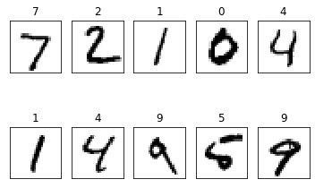

# CHAPTER 6 MNIST
## 목차
1. [MNIST 학습하기](#MNIST-학습하기)<br>
2. [드롭아웃](#드롭아웃)<br>
3. [matplotlib](#matplotlib)<br><br>


### MNIST 학습하기
교재에서, 'MNIST란 손으로 쓴 숫자들의 이미지를 모아놓은 데이터 셋으로, 0부터 9까지의 숫자를 28*28픽셀 크기의 이미지로 구성해놓은것'이라고 했다. 이러한 MNIST 데이터셋은 http://yann.lecun.com/exdb/mnist/ 에서 정리되어있는 자료를 내려받을 수 있고, 직접 내려받을 필요 없이 모듈을 임포트하면 코드를 통해 데이터셋을 내려받아 원-핫 인코딩 방식으로 읽어올 수 있다.<br>
다만 텐서플로우 2에서는 케라스와 통합되었기 때문에(정확한 것은 공부가 부족해서 잘 모르지만 일단 지금까지 알아본 바로는 그런것 같다..) 해당 모듈이 텐서플로우에서 삭제되고 케라스를 통해 내려받아야 한다고 한다. 그렇지만 케라스에서는 인코딩 방법이 달라서 다르게 코드를 변환해야 하는 엄청난 문제가,,,생길 뻔 했는데<br>
그렇지만 인터넷에서 잘 구글링을 해서 모듈을 직접 복사해주면 텐서플로우 2에서도 모듈 사용이 가능! 해결! 팀원들 최고!


```python
import tensorflow.compat.v1 as tf
tf.disable_v2_behavior()

from tensorflow.examples.tutorials.mnist import input_data
mnist = input_data.read_data_sets("./mnist/data/", one_hot = True)
```

    Extracting ./mnist/data/train-images-idx3-ubyte.gz
    Extracting ./mnist/data/train-labels-idx1-ubyte.gz
    Extracting ./mnist/data/t10k-images-idx3-ubyte.gz
    Extracting ./mnist/data/t10k-labels-idx1-ubyte.gz
    


```python
#########
# 신경망 모델 구성
######
# 입력 값의 차원은 [배치크기, 특성값] 으로 되어 있습니다.
# 손글씨 이미지는 28x28 픽셀로 이루어져 있고, 이를 784개의 특성값(28*28)으로 정합니다.
X = tf.placeholder(tf.float32, [None, 784])
# 결과는 0~9 의 10 가지 분류를 가집니다.
Y = tf.placeholder(tf.float32, [None, 10])
```

배치크기란 즉 한 번에 학습시킬 MNIST이미지의 갯수를 지정하는 값이 된다.<br>
None이라는 것은 한 번에 학습 할 개수를 계속 바꿔가며 실험하기 위한 것으로, None으로 넣어주면 텐서플로가 알아서 정해준다. 어떤 원리인지는 모르겠지만....<br>
이렇게 데이터 전체를 한 번에 학습시키지 않고 적당한 크기로 잘라서 학습시키는 것을 미니배치라고 한다.<br>
미니배치는 전체 데이터를 한 번에 학습시키면 정확하기는 하지만 너무 오래걸리게 되며, 데이터를 하나씩만 학습시킬 경우에는 효율이 떨어지게 된다. 예를 들어 하나씩 학습을 시킬경우 예외 데이터가 나왔을 경우에도 정답을 찾으려 최적화 과정을 진행하기 때문에 정확도를 오히려 낮추게 될 수 있다. 즉, 데이터 전체의 경향을 반영시키지 못한다. 따라서 적당한 갯수의 데이터로 나누어 학습을 진행하기 위해 가장 많이 사용하는 방법이다.


```python
# 신경망의 레이어는 다음처럼 구성합니다.
# 784(입력 특성값)
#   -> 256 (히든레이어 뉴런 갯수) -> 256 (히든레이어 뉴런 갯수)
#   -> 10 (결과값 0~9 분류)
W1 = tf.Variable(tf.random_normal([784, 256], stddev=0.01))
# 편향을 한 번 추가해보자!
b1 = tf.Variable(tf.zeros([256]))
# 입력값에 가중치를 곱하고 ReLU 함수를 이용하여 레이어를 만듭니다.
L1 = tf.nn.relu(tf.add(tf.matmul(X, W1),b1))

W2 = tf.Variable(tf.random_normal([256, 256], stddev=0.01))
b2 = tf.Variable(tf.zeros([256]))
# L1 레이어의 출력값에 가중치를 곱하고 ReLU 함수를 이용하여 레이어를 만듭니다.
L2 = tf.nn.relu(tf.add(tf.matmul(L1, W2),b2))

W3 = tf.Variable(tf.random_normal([256, 10], stddev=0.01))
b3 = tf.Variable(tf.zeros([10]))

# 최종 모델의 출력값은 W3 변수를 곱해 10개의 분류를 가지게 됩니다.
model = tf.add(tf.matmul(L2, W3),b3)

cost = tf.reduce_mean(tf.nn.softmax_cross_entropy_with_logits_v2(logits=model, labels=Y))
optimizer = tf.train.AdamOptimizer(0.001).minimize(cost)
```


```python
#########
# 신경망 모델 학습
######
init = tf.global_variables_initializer()
sess = tf.Session()
sess.run(init)

batch_size = 100
total_batch = int(mnist.train.num_examples / batch_size)

for epoch in range(15):
    total_cost = 0

    for i in range(total_batch):
        # 텐서플로우의 mnist 모델의 next_batch 함수를 이용해
        # 지정한 크기만큼 학습할 데이터를 가져옵니다.
        batch_xs, batch_ys = mnist.train.next_batch(batch_size)

        _, cost_val = sess.run([optimizer, cost], feed_dict={X: batch_xs, Y: batch_ys})
        total_cost += cost_val

    print('Epoch:', '%04d' % (epoch + 1),
          'Avg. cost =', '{:.3f}'.format(total_cost / total_batch))

print('최적화 완료!')
```

    Epoch: 0001 Avg. cost = 0.406
    Epoch: 0002 Avg. cost = 0.149
    Epoch: 0003 Avg. cost = 0.097
    Epoch: 0004 Avg. cost = 0.069
    Epoch: 0005 Avg. cost = 0.051
    Epoch: 0006 Avg. cost = 0.041
    Epoch: 0007 Avg. cost = 0.031
    Epoch: 0008 Avg. cost = 0.027
    Epoch: 0009 Avg. cost = 0.019
    Epoch: 0010 Avg. cost = 0.018
    Epoch: 0011 Avg. cost = 0.016
    Epoch: 0012 Avg. cost = 0.013
    Epoch: 0013 Avg. cost = 0.012
    Epoch: 0014 Avg. cost = 0.013
    Epoch: 0015 Avg. cost = 0.010
    최적화 완료!
    

batch_size를 통해 미니배치의 크기를 100개로 설정했다. 왜 100개로 고정했는데 처음에 None으로 두었는지가 의문이었는데.. 아마 텐서플로우가 따로 또 뭔가 조정을 해주는 것일지도 모른다고 생각한다..이것 역시 공부가 좀 더 필요한 걸로..<br>
epoch, 에포크는 MNIST 데이터 전체를 한번 학습하는 것이다. epoch를 15번 반복한다는 것은 같은 데이터 전체를 15번 반복해서 학습한다는 것이다. 그 내부 for문에서 데이터를 적절히 나누어 미니배치의 총 개수반큼 학습한다. 즉 전체의 데이터를 부분부분 나누어서 한번씩 학습하는 것이다.


```python
#########
# 결과 확인
######
# model 로 예측한 값과 실제 레이블인 Y의 값을 비교합니다.
# tf.argmax 함수를 이용해 예측한 값에서 가장 큰 값을 예측한 레이블이라고 평가합니다.
# 예) [0.1 0 0 0.7 0 0.2 0 0 0 0] -> 3
is_correct = tf.equal(tf.argmax(model, 1), tf.argmax(Y, 1))
accuracy = tf.reduce_mean(tf.cast(is_correct, tf.float32))
print('정확도:', sess.run(accuracy,
                        feed_dict={X: mnist.test.images,
                                   Y: mnist.test.labels}))
```

    정확도: 0.9768
    

## 드롭아웃
그러나 이렇게 높은 정확도를 보이는 신경망은 커다란 단점이 존재한다. 학습시킨 데이터와 다른 양상을 띄는 데이터에는 정확도가 굉장히 맞지 않을 수 있다.(너무 많은 레이어를 추가하여 정확도를 과하게 높이면 안되는 이유가 바로 이것이었던 것을 기억할것이다.) 이러한 문제를 해결하기 위한 다양한 방법 중에 이번에는 '드롭 아웃'을 공부해볼 것이다.<br>
드롭아웃이란, 학습시 전체 신경망을 사용하지 않고 그 중 일부만 사용하도록 하는 방법이다. 학습 단계마다 일부 뉴런을 제거하여 데이터의 특징을 모든 뉴런에게 최적화시키지 않아 가중치의 균형을 잡는다고 한다. 단 제거된 뉴런은 학습을 진행하지 못하므로 적절히 최적화시키기 위해서는 조금 더 시간이 필요하다고 한다.<br>
사용 방법은 계층 구성의 마지막에 tf.nn.dropout(레이어, 사용할 뉴런의 비율)함수를 사용하기만 하면 된다. 뒤에 들어갈 비율에 플레이스 홀더 변수를 넣으면 예측시에는 전체 뉴런을 사용하고 학습시에는 일부 뉴런만 사용하도록 하여 따로 함수를 재구성할 필요가 없당!


```python
keep_prob = tf.placeholder(tf.float32)

L1 = tf.nn.dropout(L1, keep_prob)
L2 = tf.nn.relu(tf.matmul(L1, W2))
L2 = tf.nn.dropout(L2, keep_prob)

W3 = tf.Variable(tf.random_normal([256, 10], stddev=0.01))
model = tf.matmul(L2, W3)

cost = tf.reduce_mean(tf.nn.softmax_cross_entropy_with_logits_v2(logits=model, labels=Y))
optimizer = tf.train.AdamOptimizer(0.001).minimize(cost)

#########
# 신경망 모델 학습
######
init = tf.global_variables_initializer()
sess = tf.Session()
sess.run(init)

batch_size = 100
total_batch = int(mnist.train.num_examples / batch_size)

for epoch in range(30):
    total_cost = 0

    for i in range(total_batch):
        batch_xs, batch_ys = mnist.train.next_batch(batch_size)

        _, cost_val = sess.run([optimizer, cost],
                               feed_dict={X: batch_xs,
                                          Y: batch_ys,
                                          keep_prob: 0.8})
        total_cost += cost_val

    print('Epoch:', '%04d' % (epoch + 1),
          'Avg. cost =', '{:.3f}'.format(total_cost / total_batch))

print('최적화 완료!')

#########
# 결과 확인
######
is_correct = tf.equal(tf.argmax(model, 1), tf.argmax(Y, 1))
accuracy = tf.reduce_mean(tf.cast(is_correct, tf.float32))
print('정확도:', sess.run(accuracy,
                        feed_dict={X: mnist.test.images,
                                   Y: mnist.test.labels,
                                   keep_prob: 1}))
```

    Epoch: 0001 Avg. cost = 0.432
    Epoch: 0002 Avg. cost = 0.166
    Epoch: 0003 Avg. cost = 0.116
    Epoch: 0004 Avg. cost = 0.088
    Epoch: 0005 Avg. cost = 0.074
    Epoch: 0006 Avg. cost = 0.061
    Epoch: 0007 Avg. cost = 0.053
    Epoch: 0008 Avg. cost = 0.047
    Epoch: 0009 Avg. cost = 0.043
    Epoch: 0010 Avg. cost = 0.037
    Epoch: 0011 Avg. cost = 0.035
    Epoch: 0012 Avg. cost = 0.030
    Epoch: 0013 Avg. cost = 0.028
    Epoch: 0014 Avg. cost = 0.028
    Epoch: 0015 Avg. cost = 0.026
    Epoch: 0016 Avg. cost = 0.024
    Epoch: 0017 Avg. cost = 0.024
    Epoch: 0018 Avg. cost = 0.022
    Epoch: 0019 Avg. cost = 0.020
    Epoch: 0020 Avg. cost = 0.019
    Epoch: 0021 Avg. cost = 0.018
    Epoch: 0022 Avg. cost = 0.022
    Epoch: 0023 Avg. cost = 0.020
    Epoch: 0024 Avg. cost = 0.017
    Epoch: 0025 Avg. cost = 0.018
    Epoch: 0026 Avg. cost = 0.015
    Epoch: 0027 Avg. cost = 0.019
    Epoch: 0028 Avg. cost = 0.015
    Epoch: 0029 Avg. cost = 0.016
    Epoch: 0030 Avg. cost = 0.016
    최적화 완료!
    정확도: 0.9827
    

30번의 학습을 진행하는 이유는, 앞서 말했듯 드롭아웃을 사용할 경우 학습 속도 자체는 느려지기 때문에 더 많은 학습을 진행해야 제대로 된 정확도를 나타낼 수 있다. 그런데 드롭아웃을 적용시키지 않은 모델을 사용할 경우는 과적합 현상이 일어나 오히려 많은 학습을 진행하면 정확도가 낮아질 수 있다.<br>
드롭 아웃 외에도 배치정규화라는 기법이 있다고 한다. 이 기법은 학습 속도도 함께 향상시켜준다는 장점이 있어 최근에 많이 이용되는 기법이라고 한다. tf.nn.batch_normalization과 tf.layers.batch_normalization 함수를 이용해 적용할 수 있다. 또한 tf.layers라이브러리를 이용하면 간단히 적용할 수 있다고 하는데,,, 자세한 설명을 찾아 응용해보도록 하자.<br>
교재에 나온 자세한 설명 링크는 [여기](https://goo.gl/hRG0Ir) 있다.

<details>
  <summary>
보기좋게 실패했다.. 추후에 시도해보고 성공하면 수정하자</summary>
    <div markdown="1">
      ```python
      X = tf.placeholder(tf.float32, [None, 784])
      Y = tf.placeholder(tf.float32, [None, 10])

      is_traning = tf.placeholder(tf.bool)

      W1 = tf.Variable(tf.random_normal([784, 256], stddev=0.01))
      b1 = tf.Variable(tf.zeros([256]))

      L1 = tf.nn.relu(tf.add(tf.matmul(X, W1),b1))
      L1 = tf.layers.batch_normalization(L1, training = is_traning)

      W2 = tf.Variable(tf.random_normal([256, 256], stddev=0.01))
      b2 = tf.Variable(tf.zeros([256]))

      L2 = tf.nn.relu(tf.add(tf.matmul(L1, W2),b2))
      L2 = tf.layers.batch_normalization(L2, training = is_traning)

      W3 = tf.Variable(tf.random_normal([256, 10], stddev=0.01))
      b3 = tf.Variable(tf.zeros([10]))

      W3 = tf.Variable(tf.random_normal([256, 10], stddev=0.01))
      model = tf.matmul(L2, W3)

      cost = tf.reduce_mean(tf.nn.softmax_cross_entropy_with_logits_v2(logits=model, labels=Y))
      update_ops = tf.get_collection(tf.GraphKeys.UPDATE_OPS)
      with tf.control_dependencies(update_ops):
          optimizer = tf.train.AdamOptimizer(0.001).minimize(cost)

      #########
      # 신경망 모델 학습
      ######
      init = tf.global_variables_initializer()
      sess = tf.Session()
      sess.run(init)

      batch_size = 100
      total_batch = int(mnist.train.num_examples / batch_size)

      for epoch in range(30):
          total_cost = 0

          for i in range(total_batch):
              batch_xs, batch_ys = mnist.train.next_batch(batch_size)

              _, cost_val = sess.run([optimizer, cost],
                                    feed_dict={X: batch_xs, Y: batch_ys, is_traning: True})
              total_cost += cost_val

          print('Epoch:', '%04d' % (epoch + 1),
                'Avg. cost =', '{:.3f}'.format(total_cost / total_batch))

      print('최적화 완료!')

      #########
      # 결과 확인
      ######
      is_correct = tf.equal(tf.argmax(model, 1), tf.argmax(Y, 1))
      accuracy = tf.reduce_mean(tf.cast(is_correct, tf.float32))
      print('정확도:', sess.run(accuracy,
                              feed_dict={X: mnist.test.images, Y: mnist.test.labels, is_traning: False}))
      ```


          ---------------------------------------------------------------------------

          InvalidArgumentError                      Traceback (most recent call last)

          c:\users\infinite\appdata\local\programs\python\python37\lib\site-packages\tensorflow_core\python\client\session.py in _do_call(self, fn, *args)
            1364     try:
          -> 1365       return fn(*args)
            1366     except errors.OpError as e:
          

          c:\users\infinite\appdata\local\programs\python\python37\lib\site-packages\tensorflow_core\python\client\session.py in _run_fn(feed_dict, fetch_list, target_list, options, run_metadata)
            1349       return self._call_tf_sessionrun(options, feed_dict, fetch_list,
          -> 1350                                       target_list, run_metadata)
            1351 
          

          c:\users\infinite\appdata\local\programs\python\python37\lib\site-packages\tensorflow_core\python\client\session.py in _call_tf_sessionrun(self, options, feed_dict, fetch_list, target_list, run_metadata)
            1442                                             fetch_list, target_list,
          -> 1443                                             run_metadata)
            1444 
          

          InvalidArgumentError: You must feed a value for placeholder tensor 'Placeholder_7' with dtype float and shape [?,784]
            [[{{node Placeholder_7}}]]

          
          During handling of the above exception, another exception occurred:
          

          InvalidArgumentError                      Traceback (most recent call last)

          <ipython-input-26-0f219484fff5> in <module>
              44 
              45         _, cost_val = sess.run([optimizer, cost],
          ---> 46                                feed_dict={X: batch_xs, Y: batch_ys, is_traning: True})
              47         total_cost += cost_val
              48 
          

          c:\users\infinite\appdata\local\programs\python\python37\lib\site-packages\tensorflow_core\python\client\session.py in run(self, fetches, feed_dict, options, run_metadata)
              954     try:
              955       result = self._run(None, fetches, feed_dict, options_ptr,
          --> 956                          run_metadata_ptr)
              957       if run_metadata:
              958         proto_data = tf_session.TF_GetBuffer(run_metadata_ptr)
          

          c:\users\infinite\appdata\local\programs\python\python37\lib\site-packages\tensorflow_core\python\client\session.py in _run(self, handle, fetches, feed_dict, options, run_metadata)
            1178     if final_fetches or final_targets or (handle and feed_dict_tensor):
            1179       results = self._do_run(handle, final_targets, final_fetches,
          -> 1180                              feed_dict_tensor, options, run_metadata)
            1181     else:
            1182       results = []
          

          c:\users\infinite\appdata\local\programs\python\python37\lib\site-packages\tensorflow_core\python\client\session.py in _do_run(self, handle, target_list, fetch_list, feed_dict, options, run_metadata)
            1357     if handle is None:
            1358       return self._do_call(_run_fn, feeds, fetches, targets, options,
          -> 1359                            run_metadata)
            1360     else:
            1361       return self._do_call(_prun_fn, handle, feeds, fetches)
          

          c:\users\infinite\appdata\local\programs\python\python37\lib\site-packages\tensorflow_core\python\client\session.py in _do_call(self, fn, *args)
            1382                     '\nsession_config.graph_options.rewrite_options.'
            1383                     'disable_meta_optimizer = True')
          -> 1384       raise type(e)(node_def, op, message)
            1385 
            1386   def _extend_graph(self):
          

          InvalidArgumentError: You must feed a value for placeholder tensor 'Placeholder_7' with dtype float and shape [?,784]
            [[node Placeholder_7 (defined at c:\users\infinite\appdata\local\programs\python\python37\lib\site-packages\tensorflow_core\python\framework\ops.py:1751) ]]
          
          Original stack trace for 'Placeholder_7':
            File "c:\users\infinite\appdata\local\programs\python\python37\lib\runpy.py", line 193, in _run_module_as_main
              "__main__", mod_spec)
            File "c:\users\infinite\appdata\local\programs\python\python37\lib\runpy.py", line 85, in _run_code
              exec(code, run_globals)
            File "c:\users\infinite\appdata\local\programs\python\python37\lib\site-packages\ipykernel_launcher.py", line 16, in <module>
              app.launch_new_instance()
            File "c:\users\infinite\appdata\local\programs\python\python37\lib\site-packages\traitlets\config\application.py", line 664, in launch_instance
              app.start()
            File "c:\users\infinite\appdata\local\programs\python\python37\lib\site-packages\ipykernel\kernelapp.py", line 563, in start
              self.io_loop.start()
            File "c:\users\infinite\appdata\local\programs\python\python37\lib\site-packages\tornado\platform\asyncio.py", line 148, in start
              self.asyncio_loop.run_forever()
            File "c:\users\infinite\appdata\local\programs\python\python37\lib\asyncio\base_events.py", line 538, in run_forever
              self._run_once()
            File "c:\users\infinite\appdata\local\programs\python\python37\lib\asyncio\base_events.py", line 1782, in _run_once
              handle._run()
            File "c:\users\infinite\appdata\local\programs\python\python37\lib\asyncio\events.py", line 88, in _run
              self._context.run(self._callback, *self._args)
            File "c:\users\infinite\appdata\local\programs\python\python37\lib\site-packages\tornado\ioloop.py", line 690, in <lambda>
              lambda f: self._run_callback(functools.partial(callback, future))
            File "c:\users\infinite\appdata\local\programs\python\python37\lib\site-packages\tornado\ioloop.py", line 743, in _run_callback
              ret = callback()
            File "c:\users\infinite\appdata\local\programs\python\python37\lib\site-packages\tornado\gen.py", line 787, in inner
              self.run()
            File "c:\users\infinite\appdata\local\programs\python\python37\lib\site-packages\tornado\gen.py", line 748, in run
              yielded = self.gen.send(value)
            File "c:\users\infinite\appdata\local\programs\python\python37\lib\site-packages\ipykernel\kernelbase.py", line 361, in process_one
              yield gen.maybe_future(dispatch(*args))
            File "c:\users\infinite\appdata\local\programs\python\python37\lib\site-packages\tornado\gen.py", line 209, in wrapper
              yielded = next(result)
            File "c:\users\infinite\appdata\local\programs\python\python37\lib\site-packages\ipykernel\kernelbase.py", line 268, in dispatch_shell
              yield gen.maybe_future(handler(stream, idents, msg))
            File "c:\users\infinite\appdata\local\programs\python\python37\lib\site-packages\tornado\gen.py", line 209, in wrapper
              yielded = next(result)
            File "c:\users\infinite\appdata\local\programs\python\python37\lib\site-packages\ipykernel\kernelbase.py", line 541, in execute_request
              user_expressions, allow_stdin,
            File "c:\users\infinite\appdata\local\programs\python\python37\lib\site-packages\tornado\gen.py", line 209, in wrapper
              yielded = next(result)
            File "c:\users\infinite\appdata\local\programs\python\python37\lib\site-packages\ipykernel\ipkernel.py", line 300, in do_execute
              res = shell.run_cell(code, store_history=store_history, silent=silent)
            File "c:\users\infinite\appdata\local\programs\python\python37\lib\site-packages\ipykernel\zmqshell.py", line 536, in run_cell
              return super(ZMQInteractiveShell, self).run_cell(*args, **kwargs)
            File "c:\users\infinite\appdata\local\programs\python\python37\lib\site-packages\IPython\core\interactiveshell.py", line 2848, in run_cell
              raw_cell, store_history, silent, shell_futures)
            File "c:\users\infinite\appdata\local\programs\python\python37\lib\site-packages\IPython\core\interactiveshell.py", line 2874, in _run_cell
              return runner(coro)
            File "c:\users\infinite\appdata\local\programs\python\python37\lib\site-packages\IPython\core\async_helpers.py", line 68, in _pseudo_sync_runner
              coro.send(None)
            File "c:\users\infinite\appdata\local\programs\python\python37\lib\site-packages\IPython\core\interactiveshell.py", line 3051, in run_cell_async
              interactivity=interactivity, compiler=compiler, result=result)
            File "c:\users\infinite\appdata\local\programs\python\python37\lib\site-packages\IPython\core\interactiveshell.py", line 3242, in run_ast_nodes
              if (await self.run_code(code, result,  async_=asy)):
            File "c:\users\infinite\appdata\local\programs\python\python37\lib\site-packages\IPython\core\interactiveshell.py", line 3319, in run_code
              exec(code_obj, self.user_global_ns, self.user_ns)
            File "<ipython-input-18-8eda34d453d5>", line 6, in <module>
              X = tf.placeholder(tf.float32, [None, 784])
            File "c:\users\infinite\appdata\local\programs\python\python37\lib\site-packages\tensorflow_core\python\ops\array_ops.py", line 2630, in placeholder
              return gen_array_ops.placeholder(dtype=dtype, shape=shape, name=name)
            File "c:\users\infinite\appdata\local\programs\python\python37\lib\site-packages\tensorflow_core\python\ops\gen_array_ops.py", line 6670, in placeholder
              "Placeholder", dtype=dtype, shape=shape, name=name)
            File "c:\users\infinite\appdata\local\programs\python\python37\lib\site-packages\tensorflow_core\python\framework\op_def_library.py", line 793, in _apply_op_helper
              op_def=op_def)
            File "c:\users\infinite\appdata\local\programs\python\python37\lib\site-packages\tensorflow_core\python\util\deprecation.py", line 507, in new_func
              return func(*args, **kwargs)
            File "c:\users\infinite\appdata\local\programs\python\python37\lib\site-packages\tensorflow_core\python\framework\ops.py", line 3360, in create_op
              attrs, op_def, compute_device)
            File "c:\users\infinite\appdata\local\programs\python\python37\lib\site-packages\tensorflow_core\python\framework\ops.py", line 3429, in _create_op_internal
              op_def=op_def)
            File "c:\users\infinite\appdata\local\programs\python\python37\lib\site-packages\tensorflow_core\python\framework\ops.py", line 1751, in __init__
              self._traceback = tf_stack.extract_stack()
    
    </div>
</details>


```python
import numpy as np
import matplotlib.pyplot as plt
```


```python
#########
# 결과 확인 (matplot)
######
labels = sess.run(model,
                  feed_dict={X: mnist.test.images,
                             Y: mnist.test.labels,
                             keep_prob: 1})

fig = plt.figure()
for i in range(10):
    subplot = fig.add_subplot(2, 5, i + 1)
    subplot.set_xticks([])
    subplot.set_yticks([])
    subplot.set_title('%d' % np.argmax(labels[i]))
    subplot.imshow(mnist.test.images[i].reshape((28, 28)),
                   cmap=plt.cm.gray_r)

plt.show()
```




