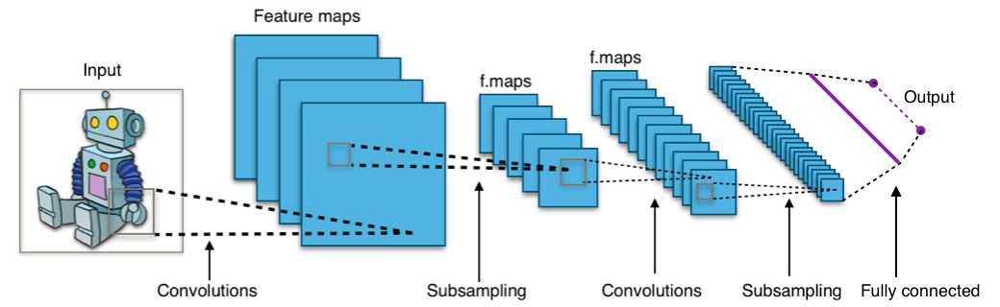

# CHAPTER 7 CNN
## 목차
1. [CNN의 개념](#CNN의-개념)<br>
2. [모델 구현하기](#모델-구현하기)<br>
3. [고수준 API](#고수준-API)<br><br>


### CNN의 개념
CNN(Convolution Neural Network)는 이미지 인식 분야에서 굉장히 강력한 성능을 발휘하는 신경망이다. 최근에는 음석인식, 자연어 처리 등에서도 사용되는 활용성 높은 신경망이라고 한다.<br>
<br>
CNN은 기본적으로 컨볼루션 계층과 풀링 계층으로 구성되며, 이 계층은 앞서 다른 신경망을 구현할때와 비슷하게 차곡차곡 쌓을 수 있다. 그리고 쌓는 방식과 계층의 갯수에 따라 성능이 차이가 나고, 또는 풀어내는 문제의 종류가 달라지기도 한다.<br>
컨벌루션 계층과 풀링 계층 모두 지정한 영역의 값을 하나의 값으로 압축해내는 역할을 한다(2차원 행렬의 경우 그렇다. 그런데 3차원 행렬도 비슷하게 구현할 경우 그렇지 않을까 하는 예상이 든다. 이것은 따로 공부해야 할 것 같다.)<br>
다만 컨벌루션 계층은 가중치와 편향을 적용하고, 풀링 계층은 지정한 영역들 중 하나의 값을 선택하여 가져온다는 차이점이 존재한다.<br>
~~궁금증)그렇다면 컨벌루션 계층에서는 컨벌루션 연산을 하니까 이름이 컨벌루션인것이겠지??~~<br>
앞서 말한 지정한 크기의 영역을 윈도우라고 하고, 이 윈도우는 가로, 세로로 한 칸씩 이동하며 은닉층을 완성한다.(가로로만 이동하면서 한 줄을 채우고, 세로로 한 칸 내려간 후 다시 가로로 이동하며 한 줄을 채우는 방식이다)<br>
컨벌루션 계층에서는 가중치는 윈도우 크기 만큼의 갯수를 필요로 하고, 편향값은 한개만을 필요로 한다. 이것들을 커널(Kernel)혹은 필터(Filter)라고 부른다. 그리고 이 커널은 은닉층을 만드는 과정의 모든 윈도우에 공통적으로 적용이 된다. 공통적으로 적용된다는 것은 엄청난 이점으로, 기존 신경망에서 찾아내야 했던 가중치의 갯수는 초기 데이터의 크기만큼이었지만, CNN을 적용한다면 윈도우 크기만큼의 가중치만 찾아내면 된다는 소리이기 때문이다. 이렇게 함으로써 떨어지는 정확도는 커널을 여러개 사용하는 방법으로 해결한다. 여러개를 사용하더라도 여전히 필요한 가중치의 갯수가 획기적으로 줄어든다는 것에는 변함이 없다! 이 커널의 갯수 또한 계층의 방식이나 갯수처럼 중요한 파라미터 중 하나가 된다.<br><br>

### 모델 구현하기


```python
import tensorflow.compat.v1 as tf
tf.disable_v2_behavior()

from tensorflow.examples.tutorials.mnist import input_data
mnist = input_data.read_data_sets("./mnist/data/", one_hot = True)

#########
# 신경망 모델 구성
######
# 기존 모델에서는 입력 값을 28x28 하나의 차원으로 구성하였으나,
# CNN 모델을 사용하기 위해 2차원 평면과 특성치의 형태를 갖는 구조로 만듭니다.
X = tf.placeholder(tf.float32, [None, 28, 28, 1])
Y = tf.placeholder(tf.float32, [None, 10])
keep_prob = tf.placeholder(tf.float32)
```

    WARNING:tensorflow:From c:\users\infinite\appdata\local\programs\python\python37\lib\site-packages\tensorflow_core\python\compat\v2_compat.py:65: disable_resource_variables (from tensorflow.python.ops.variable_scope) is deprecated and will be removed in a future version.
    Instructions for updating:
    non-resource variables are not supported in the long term
    WARNING:tensorflow:From <ipython-input-1-640d831fce8c>:5: read_data_sets (from tensorflow.examples.tutorials.mnist.input_data) is deprecated and will be removed in a future version.
    Instructions for updating:
    Please use alternatives such as: tensorflow_datasets.load('mnist')
    WARNING:tensorflow:From c:\users\infinite\appdata\local\programs\python\python37\lib\site-packages\tensorflow_core\examples\tutorials\mnist\input_data.py:297: _maybe_download (from tensorflow.examples.tutorials.mnist.input_data) is deprecated and will be removed in a future version.
    Instructions for updating:
    Please write your own downloading logic.
    WARNING:tensorflow:From c:\users\infinite\appdata\local\programs\python\python37\lib\site-packages\tensorflow_core\examples\tutorials\mnist\input_data.py:299: _extract_images (from tensorflow.examples.tutorials.mnist.input_data) is deprecated and will be removed in a future version.
    Instructions for updating:
    Please use tf.data to implement this functionality.
    Extracting ./mnist/data/train-images-idx3-ubyte.gz
    WARNING:tensorflow:From c:\users\infinite\appdata\local\programs\python\python37\lib\site-packages\tensorflow_core\examples\tutorials\mnist\input_data.py:304: _extract_labels (from tensorflow.examples.tutorials.mnist.input_data) is deprecated and will be removed in a future version.
    Instructions for updating:
    Please use tf.data to implement this functionality.
    Extracting ./mnist/data/train-labels-idx1-ubyte.gz
    WARNING:tensorflow:From c:\users\infinite\appdata\local\programs\python\python37\lib\site-packages\tensorflow_core\examples\tutorials\mnist\input_data.py:112: _dense_to_one_hot (from tensorflow.examples.tutorials.mnist.input_data) is deprecated and will be removed in a future version.
    Instructions for updating:
    Please use tf.one_hot on tensors.
    Extracting ./mnist/data/t10k-images-idx3-ubyte.gz
    Extracting ./mnist/data/t10k-labels-idx1-ubyte.gz
    WARNING:tensorflow:From c:\users\infinite\appdata\local\programs\python\python37\lib\site-packages\tensorflow_core\examples\tutorials\mnist\input_data.py:328: _DataSet.__init__ (from tensorflow.examples.tutorials.mnist.input_data) is deprecated and will be removed in a future version.
    Instructions for updating:
    Please use alternatives such as official/mnist/_DataSet.py from tensorflow/models.
    

CNN모델을 사용하기 때문에 행렬의 모양이 조금 달라진 것을 확인할 수 있다.<br>
가장 첫번째 차원은 입력 데이터의 개수이고, 6챕터에서는 이미지를 한번에 784개의 데이터로 넣어주었지만 CNN을 사용하기 때문에 2차원 행렬로 구성하였다. 마지막 차원의 의미는 특징의 개수를 의미하는데, MNIST데이터의 경우는 회색조 이미지이기 때문에 채널에 색상이 하나밖에 존재하지 않아 1을 사용하였다. 아마 컬러 이미지를 사용할 경우 특징의 갯수는 3이 될 것으로 예상한다.<br>
keep_prob은 드롭아웃을 위한 변수이다.


```python
# 각각의 변수와 레이어는 다음과 같은 형태로 구성됩니다.
# W1 [3 3 1 32] -> [3 3]: 커널 크기, 1: 입력값 X 의 특성수, 32: 필터 갯수
# L1 Conv shape=(?, 28, 28, 32)
#    Pool     ->(?, 14, 14, 32)
W1 = tf.Variable(tf.random_normal([3, 3, 1, 32], stddev=0.01))
# tf.nn.conv2d 를 이용해 한칸씩 움직이는 컨볼루션 레이어를 쉽게 만들 수 있습니다.
# padding='SAME' 은 커널 슬라이딩시 최외곽에서 한칸 밖으로 더 움직이는 옵션
L1 = tf.nn.conv2d(X, W1, strides=[1, 1, 1, 1], padding='SAME')
L1 = tf.nn.relu(L1)
print(L1)
```

    Tensor("Relu:0", shape=(?, 28, 28, 32), dtype=float32)
    

컨벌루션계층이다. 앞서 말했듯 커널에 사용할 가중치 변수는 커널의 크기와 같다. 편향값의 경우 0으로 둔 것 같다.<br>
컨벌루션 연산의 경우 함수를 사용해 간단히 구성해냈다. 아마 2d에는 2d함수를 쓰고 3d에는 3d를 쓰는 식으로 올라가는 것이 아닐까?<br>
해답_ 3d의 경우 그렇고, 4d 이상의 경우 4차원 이상을 필요로 하는 문제는 많지 않을 뿐더러, 아마 4차원을 필요로 하는 것 같아 보여도 차원을 내려서 계산할 수 있는 방법이 충분히 있는 것 같다. 또한 그런 고차원 계산은 효율이 매우 떨어지고 어려운 방법이므로 거의(라고 쓰고 절대라고 읽어도 좋을 법 하다)사용되지 않는 것 같다. 스택 오버플로우에서의 인상적인 답변은 "Do you really need so many dimensions? Can you not reduce the dimensionality before you feed it into the network?If you elaborate more about your use case we might come up with some ideas"라고..ㅋㅋㅋ<br>
가중치에서 가장 마지막 차원은 저자님께서 위 주석에 친절히 써주셨듯이, 커널의 갯수를 의미한다.<br>
padding = 'SAME'옵션을 지정하는 이유는, 이미지의 테두리까지도 정확하게 평가하기 위해서라고 한다.<br>
참고로 stddev옵션은 6장에서 미처 생각하지 못했던 옵션인데.. 정규분포의 표준편차값을 의미한다고 한다.<br>
strides의 경우, [잘 설명된 글](http://imsjhong.blogspot.com/2017/07/tensorflow-stride-reshape.html)이 있어 참고했다.<br>
[batch, height, width, channels]라는 의미로, 보통 batch와 channels는 1로 두는 것 같다.<br>
batch = 1일 경우 필터에 내용을 넣을 때 모든 이미지의 원소를 다 넣는 것 같다.<br>
프린트 결과를 보면 알 수 있듯, 윈도우는 한 칸씩 움직이고 'SAME'조건때문에 가장자리까지 한 번 더 보기 때문에 전체 행렬의 갯수는 변하지 않고 여전히 28x28인 것을 알 수 있다. 단, 아마 커널의 크기가 5x5일 경우에는 행렬의 갯수가 줄어든다거나 할 것 같기는 하다. 한 번 실험해보자.


```python
W1 = tf.Variable(tf.random_normal([9, 9, 1, 32], stddev=0.01))
L1 = tf.nn.conv2d(X, W1, strides=[1, 1, 1, 1], padding='SAME')
L1 = tf.nn.relu(L1)
print(L1)
```

실험결과 그렇지 않았다.. 하나씩 돌기 때문에 무조건 크기를 유지하는 것 같다.<br>
그런데 저 Relu_3:0은 뭐지? 계속 실행해보니 실행할 때마다 1씩 증가하고 있다. MaxPool도 마찬가지다. 뭔가 잘못한 건 아닐지 불안해지는데.. 일단은 계속 진행해보자. 아마 실행할 때마다 객체를 새로 생성하기때문에 이름을 겹치지 않게 만드는 것이라고 생각한다.


```python
# Pooling 역시 tf.nn.max_pool 을 이용하여 쉽게 구성할 수 있습니다.
L1 = tf.nn.max_pool(L1, ksize=[1, 2, 2, 1], strides=[1, 2, 2, 1], padding='SAME')
# L1 = tf.nn.dropout(L1, keep_prob)
print(L1)
```

    Tensor("MaxPool:0", shape=(?, 14, 14, 32), dtype=float32)
    

width와 height를 조절할 경우 슬라이딩 시 움직이는 칸의 갯수를 조절할 수 있다. ksize의 경우 커널의 크기를 지정한다.<br>
풀링의 경우 윈도우를 한 칸만 이동하는 것은 아닌 것 같고, 데이터를 윈도우 크기의 셀로 나누어 그중에 하나만 뽑아 재구성한다는 느낌으로 생각하면 될 것 같다. 일종의 압축이다. (이창우교수님이 생각난당.)


```python
# L2 Conv shape=(?, 14, 14, 64)
#    Pool     ->(?, 7, 7, 64)
# W2 의 [3, 3, 32, 64] 에서 32 는 L1 에서 출력된 W1 의 마지막 차원, 필터의 크기 입니다.
W2 = tf.Variable(tf.random_normal([3, 3, 32, 64], stddev=0.01))
L2 = tf.nn.conv2d(L1, W2, strides=[1, 1, 1, 1], padding='SAME')
L2 = tf.nn.relu(L2)
L2 = tf.nn.max_pool(L2, ksize=[1, 2, 2, 1], strides=[1, 2, 2, 1], padding='SAME')
# L2 = tf.nn.dropout(L2, keep_prob)
```

두번째 계층을 만들었다. 미래의 나는 [3,3,32,64]에서 세번째칸은 분명 특징의 갯수였는데 왜 늘어났지?! 라고 생각할 것이다. 이는 첫번째 계층의 커널 갯수는 곧 첫번째 계층이 발견한 특징의 갯수와 같기 때문이라고 한다. 커널의 개수 = 출력층의 개수 = 두번째에서 받은 데이터의 특징의 개수 가 되는것이다. ~~이렇게 받아낸 데이터를 두개로만 늘려도 레이어의 갯수는 64로 늘어나버린다. 64가 큰 숫자라고 생각하면 안되는 이유이다. 적어도 받은만큼은 커널을 만들어줘야 하는 것 같다.~~이따가 16개로 줄여서 해보고 정확한 답을 쓰는걸로!<br>


```python
# FC 레이어: 입력값 7x7x64 -> 출력값 256
# Full connect를 위해 직전의 Pool 사이즈인 (?, 7, 7, 64) 를 참고하여 차원을 줄여줍니다.
#    Reshape  ->(?, 256)
W3 = tf.Variable(tf.random_normal([7 * 7 * 64, 256], stddev=0.01))
L3 = tf.reshape(L2, [-1, 7 * 7 * 64])
L3 = tf.matmul(L3, W3)
L3 = tf.nn.relu(L3)
L3 = tf.nn.dropout(L3, keep_prob)
```

    WARNING:tensorflow:From <ipython-input-5-36747cae9167>:8: calling dropout (from tensorflow.python.ops.nn_ops) with keep_prob is deprecated and will be removed in a future version.
    Instructions for updating:
    Please use `rate` instead of `keep_prob`. Rate should be set to `rate = 1 - keep_prob`.
    

WARNING이 재미있는 정보를 전해주었다.. keep_prob가 사라질거라는,,<br>
마지막 출력단은 완전 연결 계층으로, 우리가 원하는 10개의 분류를 만들어내는 역할을 한다.<br>
reshape의 경우 [아까 위에서 언급했던 곳](http://imsjhong.blogspot.com/2017/07/tensorflow-stride-reshape.html)에 친절한 설명이 올라와있다. [batch_size, image_rows, image_cols, number_of_colors]이라는 의미로, batch_size = -1경우 배치사이즈를 텐서플로우가 자동으로 조절해준다.<br>
reshape를 통해 아까 우리가 만들었던 두번째 계층의 풀링 계층 크기가 7x7x64였기 때문에, 이 계층을 해당 크기 만큼의 원소를 가진 1차원으로 잘 정리해준다고 한다. 그래서 이미지를 1차원으로 만들고 그것이 배치 사이즈만큼의 갯수로 존재하는 2차원 행렬이 최종적으로 L3에 들어가게 될 것이다.<br>
그럼 matmul을 통해 행렬곱셈을 하는 과정에서 7x7x64는 사라지고 [배치사이즈, 256]의 크기를 갖는 행렬이 만들어질 것이다!


```python
# 최종 출력값 L3 에서의 출력 256개를 입력값으로 받아서 0~9 레이블인 10개의 출력값을 만듭니다.
W4 = tf.Variable(tf.random_normal([256, 10], stddev=0.01))
model = tf.matmul(L3, W4)
```

최종적으로 model에는 [배치사이즈, 256]x[256,10] = [배치사이즈, 10]의 크기를 갖는 행렬이 출력이 되고 우리는 상세 과정을 모르고 보면 아주 간단하고 행복하게 원하는 데이터가 계산되어 나오게 될 것이다!(행렬 공부를 좀 해야할 것 같다.)


```python
cost = tf.reduce_mean(tf.nn.softmax_cross_entropy_with_logits_v2(logits=model, labels=Y))
optimizer = tf.train.AdamOptimizer(0.001).minimize(cost)
# 최적화 함수를 RMSPropOptimizer 로 바꿔서 결과를 확인해봅시다.
# optimizer = tf.train.RMSPropOptimizer(0.001, 0.9).minimize(cost)

#########
# 신경망 모델 학습
######
init = tf.global_variables_initializer()
sess = tf.Session()
sess.run(init)

batch_size = 100
total_batch = int(mnist.train.num_examples / batch_size)

for epoch in range(15):
    total_cost = 0

    for i in range(total_batch):
        batch_xs, batch_ys = mnist.train.next_batch(batch_size)
        # 이미지 데이터를 CNN 모델을 위한 자료형태인 [28 28 1] 의 형태로 재구성합니다.
        batch_xs = batch_xs.reshape(-1, 28, 28, 1)

        _, cost_val = sess.run([optimizer, cost],
                               feed_dict={X: batch_xs,
                                          Y: batch_ys,
                                          keep_prob: 0.7})
        total_cost += cost_val

    print('Epoch:', '%04d' % (epoch + 1),
          'Avg. cost =', '{:.3f}'.format(total_cost / total_batch))

print('최적화 완료!')

#########
# 결과 확인
######
is_correct = tf.equal(tf.argmax(model, 1), tf.argmax(Y, 1))
accuracy = tf.reduce_mean(tf.cast(is_correct, tf.float32))
print('정확도:', sess.run(accuracy,
                        feed_dict={X: mnist.test.images.reshape(-1, 28, 28, 1),
                                   Y: mnist.test.labels,
                                   keep_prob: 1}))
```

    Epoch: 0001 Avg. cost = 0.337
    Epoch: 0002 Avg. cost = 0.103
    Epoch: 0003 Avg. cost = 0.075
    Epoch: 0004 Avg. cost = 0.059
    Epoch: 0005 Avg. cost = 0.048
    Epoch: 0006 Avg. cost = 0.042
    Epoch: 0007 Avg. cost = 0.034
    Epoch: 0008 Avg. cost = 0.032
    Epoch: 0009 Avg. cost = 0.028
    Epoch: 0010 Avg. cost = 0.025
    Epoch: 0011 Avg. cost = 0.022
    Epoch: 0012 Avg. cost = 0.020
    Epoch: 0013 Avg. cost = 0.019
    Epoch: 0014 Avg. cost = 0.017
    Epoch: 0015 Avg. cost = 0.016
    최적화 완료!
    정확도: 0.9905
    

아까 내가 제기했던 의문에 대한 실행이다.


```python
X = tf.placeholder(tf.float32, [None, 28, 28, 1])
Y = tf.placeholder(tf.float32, [None, 10])
keep_prob = tf.placeholder(tf.float32)

W1 = tf.Variable(tf.random_normal([3, 3, 1, 32], stddev=0.01))
L1 = tf.nn.conv2d(X, W1, strides=[1, 1, 1, 1], padding='SAME')
L1 = tf.nn.relu(L1)
L1 = tf.nn.max_pool(L1, ksize=[1, 2, 2, 1], strides=[1, 2, 2, 1], padding='SAME')

W2 = tf.Variable(tf.random_normal([3, 3, 32, 16], stddev=0.01))
L2 = tf.nn.conv2d(L1, W2, strides=[1, 1, 1, 1], padding='SAME')
L2 = tf.nn.relu(L2)
L2 = tf.nn.max_pool(L2, ksize=[1, 2, 2, 1], strides=[1, 2, 2, 1], padding='SAME')


W3 = tf.Variable(tf.random_normal([7 * 7 * 16, 256], stddev=0.01))
L3 = tf.reshape(L2, [-1, 7 * 7 * 16])
L3 = tf.matmul(L3, W3)
L3 = tf.nn.relu(L3)
L3 = tf.nn.dropout(L3, keep_prob)

W4 = tf.Variable(tf.random_normal([256, 10], stddev=0.01))
model = tf.matmul(L3, W4)

cost = tf.reduce_mean(tf.nn.softmax_cross_entropy_with_logits_v2(logits=model, labels=Y))
optimizer = tf.train.AdamOptimizer(0.001).minimize(cost)


init = tf.global_variables_initializer()
sess = tf.Session()
sess.run(init)

batch_size = 100
total_batch = int(mnist.train.num_examples / batch_size)

for epoch in range(15):
    total_cost = 0

    for i in range(total_batch):
        batch_xs, batch_ys = mnist.train.next_batch(batch_size)
        batch_xs = batch_xs.reshape(-1, 28, 28, 1)

        _, cost_val = sess.run([optimizer, cost],
                               feed_dict={X: batch_xs,
                                          Y: batch_ys,
                                          keep_prob: 0.7})
        total_cost += cost_val

    print('Epoch:', '%04d' % (epoch + 1),
          'Avg. cost =', '{:.3f}'.format(total_cost / total_batch))

print('최적화 완료!')


is_correct = tf.equal(tf.argmax(model, 1), tf.argmax(Y, 1))
accuracy = tf.reduce_mean(tf.cast(is_correct, tf.float32))
print('정확도:', sess.run(accuracy,
                        feed_dict={X: mnist.test.images.reshape(-1, 28, 28, 1),
                                   Y: mnist.test.labels,
                                   keep_prob: 1}))
```

    Epoch: 0001 Avg. cost = 0.429
    Epoch: 0002 Avg. cost = 0.141
    Epoch: 0003 Avg. cost = 0.102
    Epoch: 0004 Avg. cost = 0.082
    Epoch: 0005 Avg. cost = 0.068
    Epoch: 0006 Avg. cost = 0.057
    Epoch: 0007 Avg. cost = 0.051
    Epoch: 0008 Avg. cost = 0.044
    Epoch: 0009 Avg. cost = 0.038
    Epoch: 0010 Avg. cost = 0.035
    Epoch: 0011 Avg. cost = 0.030
    Epoch: 0012 Avg. cost = 0.027
    Epoch: 0013 Avg. cost = 0.026
    Epoch: 0014 Avg. cost = 0.022
    Epoch: 0015 Avg. cost = 0.023
    최적화 완료!
    정확도: 0.989
    

안타깝게도 예측은 틀렸다. 앞의 계층에서 사용했던 커널의 갯수와 현재 계층의 커널 갯수는 전혀 상관이 없는 것 같다. 오류가 나질 않는다.
