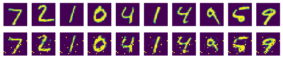

# CHAPTER 8 비지도 학습법 - Autoencoder
## 목차
1. [오토인코더 개념](#오토인코더-개념)<br>
2. [오토인코더 구현하기](#오토인코더-구현하기)<br><br>


### 서론
이 책을 배우기 이전, 김성훈님의 강좌에서 머신러닝에 배운 바에 따르면 머신러닝은 학습 방법에 따라 Supervised learning(지도 학습)과 Unsupervised learning(비지도학습)으로 나뉜다고 했다. 지도 학습은 정해진 data로 학습하는데, 이를 labeled-traning set이라고 하고, 예시로는 우리가 지금까지 했던 방식처럼 개와 고양이 등의 명확한 정답이 있는 데이터를 제시하여 학습시키는 것이다. 이러한 방식은 일반적인 문제에 많이 쓰인다. 비지도학습은 반대로 un-labeled data를 이용하여 학습시키는 것이다. 골빈해커님의 설명으로는 지도학습은 X와 Y가 둘 다 있는 상태에서, 비지도학습은 X만 있는 상태에서 학습하는 것이라고 하셨다. Unsupervised learning 중 가장 널리 쓰이는 신경망인 Autoencoder를 사용해보자.<br>

### 오토인코더 개념
오토인코더는 입력값과 출력값을 같게 하는 신경망이다.<br>
<br>
보이는 것처럼 가운데에 있는 은닉층의 노드수가 입력값보다 적은 것이 특징으로, 입력데이터를 압축하는 효과를 가짐과 동시에 노이즈를 제거하는데에 효과적이라고 한다.<br>
핵심은 입력값과 출력값이 비슷해지는 가중치를 찾아내는 것이다.

### 오토인코더 구현하기


```python
# 대표적인 비지도(Unsupervised) 학습 방법인 Autoencoder 를 구현해봅니다.
import tensorflow.compat.v1 as tf
import numpy as np
import matplotlib.pyplot as plt
tf.disable_v2_behavior()

from tensorflow.examples.tutorials.mnist import input_data
mnist = input_data.read_data_sets("./mnist/data/", one_hot=True)

#########
# 옵션 설정
######
learning_rate = 0.01
training_epoch = 20
batch_size = 100
# 신경망 레이어 구성 옵션
n_hidden = 256  # 히든 레이어의 뉴런 갯수
n_input = 28*28   # 입력값 크기 - 이미지 픽셀수
```

    WARNING:tensorflow:From c:\users\infinite\appdata\local\programs\python\python37\lib\site-packages\tensorflow_core\python\compat\v2_compat.py:65: disable_resource_variables (from tensorflow.python.ops.variable_scope) is deprecated and will be removed in a future version.
    Instructions for updating:
    non-resource variables are not supported in the long term
    WARNING:tensorflow:From <ipython-input-1-743ad1d2c683>:8: read_data_sets (from tensorflow.examples.tutorials.mnist.input_data) is deprecated and will be removed in a future version.
    Instructions for updating:
    Please use alternatives such as: tensorflow_datasets.load('mnist')
    WARNING:tensorflow:From c:\users\infinite\appdata\local\programs\python\python37\lib\site-packages\tensorflow_core\examples\tutorials\mnist\input_data.py:297: _maybe_download (from tensorflow.examples.tutorials.mnist.input_data) is deprecated and will be removed in a future version.
    Instructions for updating:
    Please write your own downloading logic.
    WARNING:tensorflow:From c:\users\infinite\appdata\local\programs\python\python37\lib\site-packages\tensorflow_core\examples\tutorials\mnist\input_data.py:299: _extract_images (from tensorflow.examples.tutorials.mnist.input_data) is deprecated and will be removed in a future version.
    Instructions for updating:
    Please use tf.data to implement this functionality.
    Extracting ./mnist/data/train-images-idx3-ubyte.gz
    WARNING:tensorflow:From c:\users\infinite\appdata\local\programs\python\python37\lib\site-packages\tensorflow_core\examples\tutorials\mnist\input_data.py:304: _extract_labels (from tensorflow.examples.tutorials.mnist.input_data) is deprecated and will be removed in a future version.
    Instructions for updating:
    Please use tf.data to implement this functionality.
    Extracting ./mnist/data/train-labels-idx1-ubyte.gz
    WARNING:tensorflow:From c:\users\infinite\appdata\local\programs\python\python37\lib\site-packages\tensorflow_core\examples\tutorials\mnist\input_data.py:112: _dense_to_one_hot (from tensorflow.examples.tutorials.mnist.input_data) is deprecated and will be removed in a future version.
    Instructions for updating:
    Please use tf.one_hot on tensors.
    Extracting ./mnist/data/t10k-images-idx3-ubyte.gz
    Extracting ./mnist/data/t10k-labels-idx1-ubyte.gz
    WARNING:tensorflow:From c:\users\infinite\appdata\local\programs\python\python37\lib\site-packages\tensorflow_core\examples\tutorials\mnist\input_data.py:328: _DataSet.__init__ (from tensorflow.examples.tutorials.mnist.input_data) is deprecated and will be removed in a future version.
    Instructions for updating:
    Please use alternatives such as official/mnist/_DataSet.py from tensorflow/models.
    

위 옵션들은 하이퍼 파라미터들이다. 의미는 아마 이미 알고 있을 것으로 알고, 모르겠다면 이전에 공부했던것을 복습해보자.


```python
#########
# 신경망 모델 구성
######
# Y 가 없습니다. 입력값을 Y로 사용하기 때문입니다.
X = tf.placeholder(tf.float32, [None, n_input])

# 인코더 레이어와 디코더 레이어의 가중치와 편향 변수를 설정합니다.
# 다음과 같이 이어지는 레이어를 구성하기 위한 값들 입니다.
# input -> encode -> decode -> output
W_encode = tf.Variable(tf.random_normal([n_input, n_hidden]))
b_encode = tf.Variable(tf.random_normal([n_hidden]))
# sigmoid 함수를 이용해 신경망 레이어를 구성합니다.
# sigmoid(X * W + b)
# 인코더 레이어 구성
encoder = tf.nn.sigmoid(
                tf.add(tf.matmul(X, W_encode), b_encode))

# encode 의 아웃풋 크기를 입력값보다 작은 크기로 만들어 정보를 압축하여 특성을 뽑아내고,
# decode 의 출력을 입력값과 동일한 크기를 갖도록하여 입력과 똑같은 아웃풋을 만들어 내도록 합니다.
# 히든 레이어의 구성과 특성치을 뽑아내는 알고리즘을 변경하여 다양한 오토인코더를 만들 수 있습니다.
W_decode = tf.Variable(tf.random_normal([n_hidden, n_input]))
b_decode = tf.Variable(tf.random_normal([n_input]))
# 디코더 레이어 구성
# 이 디코더가 최종 모델이 됩니다.
decoder = tf.nn.sigmoid(
                tf.add(tf.matmul(encoder, W_decode), b_decode))
```

인코더는 입력값을 받아 은닉층 뉴런 갯수만큼의 출력을 낸다. 디코더는 반대로 은닉층 뉴런 갯수만큼의 입력을 받아 입력값과 동일한 갯수의 출력값을 낸다. sigmoid는 활성화 함수로서, 아마 이것이 가장 효율적이기 때문에 쓴 것 같다. 왜 효율적인지는.. 알려고 하지 않는 것이 정신 건강에 이로울 것 같다. 골빈해커님은 n_input>n_hidden인 것이 중요하다고 강조하셨다.


```python
# 디코더는 인풋과 최대한 같은 결과를 내야 하므로, 디코딩한 결과를 평가하기 위해
# 입력 값인 X 값을 평가를 위한 실측 결과 값으로하여 decoder 와의 차이를 손실값으로 설정합니다.
cost = tf.reduce_mean(tf.pow(X - decoder, 2))
optimizer = tf.train.RMSPropOptimizer(learning_rate).minimize(cost)

#########
# 신경망 모델 학습
######
init = tf.global_variables_initializer()
sess = tf.Session()
sess.run(init)

total_batch = int(mnist.train.num_examples/batch_size)

for epoch in range(training_epoch):
    total_cost = 0

    for i in range(total_batch):
        batch_xs, batch_ys = mnist.train.next_batch(batch_size)
        _, cost_val = sess.run([optimizer, cost],
                               feed_dict={X: batch_xs})
        total_cost += cost_val

    print('Epoch:', '%04d' % (epoch + 1),
          'Avg. cost =', '{:.4f}'.format(total_cost / total_batch))

print('최적화 완료!')
```

    WARNING:tensorflow:From c:\users\infinite\appdata\local\programs\python\python37\lib\site-packages\tensorflow_core\python\training\rmsprop.py:119: calling Ones.__init__ (from tensorflow.python.ops.init_ops) with dtype is deprecated and will be removed in a future version.
    Instructions for updating:
    Call initializer instance with the dtype argument instead of passing it to the constructor
    Epoch: 0001 Avg. cost = 0.2013
    Epoch: 0002 Avg. cost = 0.0566
    Epoch: 0003 Avg. cost = 0.0454
    Epoch: 0004 Avg. cost = 0.0397
    Epoch: 0005 Avg. cost = 0.0373
    Epoch: 0006 Avg. cost = 0.0357
    Epoch: 0007 Avg. cost = 0.0347
    Epoch: 0008 Avg. cost = 0.0335
    Epoch: 0009 Avg. cost = 0.0328
    Epoch: 0010 Avg. cost = 0.0321
    Epoch: 0011 Avg. cost = 0.0317
    Epoch: 0012 Avg. cost = 0.0313
    Epoch: 0013 Avg. cost = 0.0307
    Epoch: 0014 Avg. cost = 0.0304
    Epoch: 0015 Avg. cost = 0.0302
    Epoch: 0016 Avg. cost = 0.0294
    Epoch: 0017 Avg. cost = 0.0290
    Epoch: 0018 Avg. cost = 0.0288
    Epoch: 0019 Avg. cost = 0.0285
    Epoch: 0020 Avg. cost = 0.0283
    최적화 완료!
    


```python
#########
# 결과 확인
# 입력값(위쪽)과 모델이 생성한 값(아래쪽)을 시각적으로 비교해봅니다.
######
sample_size = 10

samples = sess.run(decoder,
                   feed_dict={X: mnist.test.images[:sample_size]})

fig, ax = plt.subplots(2, sample_size, figsize=(sample_size, 2))

for i in range(sample_size):
    ax[0][i].set_axis_off()
    ax[1][i].set_axis_off()
    ax[0][i].imshow(np.reshape(mnist.test.images[i], (28, 28)))
    ax[1][i].imshow(np.reshape(samples[i], (28, 28)))

plt.show()
```





결과를 확인하는 과정은 보기 쉽게 matplotlib을 이용하였다. 보시다시피 꽤나 정확한 이미지를 생성해내는 것을 발견할 수 있다.
즉 우리는 decoder를 이용해 입력값을 전달하고 출력값을 받아오기만 하면 되고 세부 구조는 구현할때만 알면 된다는 것이다(하지만 우리가 구현하기 위해서는 알아야 한다.)
