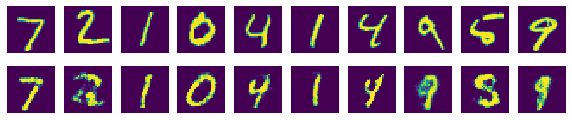
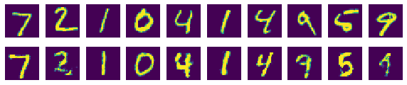

# CHAPTER 9 GAN
## 목차
1. [GAN 기본 모델 구현하기](#GAN-기본-모델-구현하기)<br>
2. [원하는 숫자 생성하기](#원하는-숫자-생성하기)<br><br>

### 서론
GAN(Generative Adversarial Network)을 설명할 때 가장 많이 드는 예시가 바로 위조지폐범과 경찰이다. 위조지폐범은 경찰을 속이려고 노력하고, 경찰은 그 위조지폐를 감별하려고 노력하기 때문에 나중에는 진짜 지폐와 구분할 수 없을 정도로 정교한 위조 지폐가 만들어진다는 이야기다. 여담으로 이러한 일이 발생하는 것을 막기 위해 굉장히 조잡한 위조범죄는 가벼운 처벌로 끝내고 있고 이것을 이용해 위조범들도 일부러 위조서류를 너무 정교하게 만들지 않는다는 이야기를 들은 적이 있다. 여기서 경찰이 바로 분류모델이고, 위조지폐범이 바로 생성모델이다.<br>
<br>
생성자를 통해 임의의 이미지를 만들고 구분자를 통해 이것이 진짜인지 가짜인지 감별하게 하는 작업을 반복한다.<br>
구분자와 생성자가 정교해질 수록 생성자는 실제 이미지와 비슷한 이미지를 생성할 수 있게 된다.<br>
이전에 종합설계시간에도 봤듯이, GAN을 이용해 응용할 수 있는 분야는 무궁무진하다.<br>
또한 이미지에 그치지 않고 GAN기법을 이용해 자연어 문장을 생성하는 등으로도 응용이 가능하고, 현재 연구가 이루어지고 있다고 한다.

### GAN 기본 모델 구현하기


```python
# 2016년에 가장 관심을 많이 받았던 비감독(Unsupervised) 학습 방법인
# Generative Adversarial Network(GAN)을 구현해봅니다.
# https://arxiv.org/abs/1406.2661
import tensorflow.compat.v1 as tf
import numpy as np  # 우리가 생성한 이미지를 보여주기 위해 matplotlib와 numpy도 함께 import함
import matplotlib.pyplot as plt
tf.disable_v2_behavior()

from tensorflow.examples.tutorials.mnist import input_data
mnist = input_data.read_data_sets("./mnist/data/", one_hot=True)

#########
# 옵션 설정
######
total_epoch = 100
batch_size = 100
learning_rate = 0.0002
# 신경망 레이어 구성 옵션
n_hidden = 256
n_input = 28 * 28
n_noise = 128  # 생성기의 입력값으로 사용할 노이즈의 크기

#########
# 신경망 모델 구성
######
# GAN 도 Unsupervised 학습이므로 Autoencoder 처럼 Y 를 사용하지 않습니다.
X = tf.placeholder(tf.float32, [None, n_input])
# 노이즈 Z를 입력값으로 사용합니다.
Z = tf.placeholder(tf.float32, [None, n_noise])

# 생성기 신경망에 사용하는 변수들입니다.
# 은닉층으로 출력되는 변수
G_W1 = tf.Variable(tf.random_normal([n_noise, n_hidden], stddev=0.01))
G_b1 = tf.Variable(tf.zeros([n_hidden]))
# 출력층에서 사용되는 변수
G_W2 = tf.Variable(tf.random_normal([n_hidden, n_input], stddev=0.01))
G_b2 = tf.Variable(tf.zeros([n_input]))

# 판별기 신경망에 사용하는 변수들입니다.
D_W1 = tf.Variable(tf.random_normal([n_input, n_hidden], stddev=0.01))
D_b1 = tf.Variable(tf.zeros([n_hidden]))
# 판별기의 최종 결과값은 얼마나 진짜와 가깝냐를 판단하는 한 개의 스칼라값입니다.
D_W2 = tf.Variable(tf.random_normal([n_hidden, 1], stddev=0.01))
D_b2 = tf.Variable(tf.zeros([1]))
```

    WARNING:tensorflow:From c:\users\infinite\appdata\local\programs\python\python37\lib\site-packages\tensorflow_core\python\compat\v2_compat.py:65: disable_resource_variables (from tensorflow.python.ops.variable_scope) is deprecated and will be removed in a future version.
    Instructions for updating:
    non-resource variables are not supported in the long term
    WARNING:tensorflow:From <ipython-input-1-734ff570ff53>:10: read_data_sets (from tensorflow.examples.tutorials.mnist.input_data) is deprecated and will be removed in a future version.
    Instructions for updating:
    Please use alternatives such as: tensorflow_datasets.load('mnist')
    WARNING:tensorflow:From c:\users\infinite\appdata\local\programs\python\python37\lib\site-packages\tensorflow_core\examples\tutorials\mnist\input_data.py:297: _maybe_download (from tensorflow.examples.tutorials.mnist.input_data) is deprecated and will be removed in a future version.
    Instructions for updating:
    Please write your own downloading logic.
    WARNING:tensorflow:From c:\users\infinite\appdata\local\programs\python\python37\lib\site-packages\tensorflow_core\examples\tutorials\mnist\input_data.py:299: _extract_images (from tensorflow.examples.tutorials.mnist.input_data) is deprecated and will be removed in a future version.
    Instructions for updating:
    Please use tf.data to implement this functionality.
    Extracting ./mnist/data/train-images-idx3-ubyte.gz
    WARNING:tensorflow:From c:\users\infinite\appdata\local\programs\python\python37\lib\site-packages\tensorflow_core\examples\tutorials\mnist\input_data.py:304: _extract_labels (from tensorflow.examples.tutorials.mnist.input_data) is deprecated and will be removed in a future version.
    Instructions for updating:
    Please use tf.data to implement this functionality.
    Extracting ./mnist/data/train-labels-idx1-ubyte.gz
    WARNING:tensorflow:From c:\users\infinite\appdata\local\programs\python\python37\lib\site-packages\tensorflow_core\examples\tutorials\mnist\input_data.py:112: _dense_to_one_hot (from tensorflow.examples.tutorials.mnist.input_data) is deprecated and will be removed in a future version.
    Instructions for updating:
    Please use tf.one_hot on tensors.
    Extracting ./mnist/data/t10k-images-idx3-ubyte.gz
    Extracting ./mnist/data/t10k-labels-idx1-ubyte.gz
    WARNING:tensorflow:From c:\users\infinite\appdata\local\programs\python\python37\lib\site-packages\tensorflow_core\examples\tutorials\mnist\input_data.py:328: _DataSet.__init__ (from tensorflow.examples.tutorials.mnist.input_data) is deprecated and will be removed in a future version.
    Instructions for updating:
    Please use alternatives such as official/mnist/_DataSet.py from tensorflow/models.
    

여기서 판별자 신경망과 구분자 신경방은 같은 변수를 사용하여야 한다고 한다.<br>
우리는 구분자가 0~1사이의 값으로 진짜 이미지인지 가짜 이미지인지를 출력할 것이다.<br>
만약 스칼라값의 범위가 커진다면 어느정도로 진짜이미지에 가까운지 그 정도를 표시하게 할 수도 있을 것이다.


```python
# 생성기(G) 신경망을 구성합니다.
def generator(noise_z):
    hidden = tf.nn.relu(
                    tf.matmul(noise_z, G_W1) + G_b1)
    output = tf.nn.sigmoid(
                    tf.matmul(hidden, G_W2) + G_b2)

    return output
```

생성자는 무작위로 생성한 노이즈를 받아 은닉층을 만들고, 은닉층에서 이미지와 같은 크기의 결과를 출력해낸다.<br>
왜 relu와 sigmoid를 사용하는지를 알기 위해서는 엄청난것을 알아야 할 것 같은 느낌이 들어 그냥 묻어두기로 했다..<br>


```python
# 판별기(D) 신경망을 구성합니다.
def discriminator(inputs):
    hidden = tf.nn.relu(
                    tf.matmul(inputs, D_W1) + D_b1)
    output = tf.nn.sigmoid(
                    tf.matmul(hidden, D_W2) + D_b2)

    return output
```

구분자와 생성자는 완전히 같은 구성이어야 하므로, 같은 구성을 사용하되 출력값이 0~1 사이의 스칼라값 하나인 것만 다르다.<br>
물론 이것은 변수 설정시 조정한 사안이기 때문에 함수에서 보여지는 구성은 완전히 같다.


```python
# 랜덤한 노이즈(Z)를 만듭니다.
def get_noise(batch_size, n_noise):
    return np.random.normal(size=(batch_size, n_noise))
```

이제 GAN모델을 실제로 학습시켜보자.<br>
우리가 사용하는 모델에서 1은 진짜 이미지, 0은 가짜이미지이다. 따라서 판별기에서 D_real은 1에, D_gene은 0에 가까워야 한다.<br>
이를 loss_D라고 하면, 다음과 같다.


```python
# 노이즈를 이용해 랜덤한 이미지를 생성합니다.
G = generator(Z)
# 노이즈를 이용해 생성한 이미지가 진짜 이미지인지 판별한 값을 구합니다.
D_gene = discriminator(G)
# 진짜 이미지를 이용해 판별한 값을 구합니다.
D_real = discriminator(X)

# 논문에 따르면, GAN 모델의 최적화는 loss_G 와 loss_D 를 최대화 하는 것 입니다.
# 다만 loss_D와 loss_G는 서로 연관관계가 있기 때문에 두 개의 손실값이 항상 같이 증가하는 경향을 보이지는 않을 것 입니다.
# loss_D가 증가하려면 loss_G는 하락해야하고, loss_G가 증가하려면 loss_D는 하락해야하는 경쟁관계에 있기 때문입니다.
# 논문의 수식에 따른 다음 로직을 보면 loss_D 를 최대화하기 위해서는 D_gene 값을 최소화하게 됩니다.
# 판별기에 진짜 이미지를 넣었을 때에도 최대값을 : tf.log(D_real)
# 가짜 이미지를 넣었을 때에도 최대값을 : tf.log(1 - D_gene)
# 갖도록 학습시키기 때문입니다.
# 이것은 판별기는 생성기가 만들어낸 이미지가 가짜라고 판단하도록 판별기 신경망을 학습시킵니다.
loss_D = tf.reduce_mean(tf.log(D_real) + tf.log(1 - D_gene))
```

반면에 생성자에서는 D_gene이 1에 가까울수록 성공적이다. 가짜 이미지를 진짜처럼 만들기만 하면 되기 때문이다.


```python
# 반면 loss_G 를 최대화하기 위해서는 D_gene 값을 최대화하게 되는데,
# 이것은 가짜 이미지를 넣었을 때, 판별기가 최대한 실제 이미지라고 판단하도록 생성기 신경망을 학습시킵니다.
# 논문에서는 loss_D 와 같은 수식으로 최소화 하는 생성기를 찾지만,
# 결국 D_gene 값을 최대화하는 것이므로 다음과 같이 사용할 수 있습니다.
loss_G = tf.reduce_mean(tf.log(D_gene))
```

GAN의 최종 목표는 위의 loss_D와 loss_G를 모두 최대화 하는 것이다. 그러나 서로 연관되어 있는 두 손실값은 서로 경쟁관계이기 때문에 항상 같이 증가하지는 않는다.<br>
또한 두 손실값에 대한 학습을 진행할 때는 변수를 구분해 사용해야 한다. 구분자에 대한 학습을 진행할 때 생성자가 변하거나 반대로 생성자에 대한 학습을 진행할 때 구분자가 함께 변하면 안되기 때문이다.


```python
# loss_D 를 구할 때는 판별기 신경망에 사용되는 변수만 사용하고,
# loss_G 를 구할 때는 생성기 신경망에 사용되는 변수만 사용하여 최적화를 합니다.
D_var_list = [D_W1, D_b1, D_W2, D_b2]
G_var_list = [G_W1, G_b1, G_W2, G_b2]

# GAN 논문의 수식에 따르면 loss 를 극대화 해야하지만, minimize 하는 최적화 함수를 사용하기 때문에
# 최적화 하려는 loss_D 와 loss_G 에 음수 부호를 붙여줍니다.
train_D = tf.train.AdamOptimizer(learning_rate).minimize(-loss_D,
                                                         var_list=D_var_list)
train_G = tf.train.AdamOptimizer(learning_rate).minimize(-loss_G,
                                                         var_list=G_var_list)
```


```python
#########
# 신경망 모델 학습
######
sess = tf.Session()
sess.run(tf.global_variables_initializer())

total_batch = int(mnist.train.num_examples/batch_size)
loss_val_D, loss_val_G = 0, 0

for epoch in range(total_epoch):
    for i in range(total_batch):
        batch_xs, batch_ys = mnist.train.next_batch(batch_size)
        noise = get_noise(batch_size, n_noise)

        # 판별기와 생성기 신경망을 각각 학습시킵니다.
        _, loss_val_D = sess.run([train_D, loss_D],
                                 feed_dict={X: batch_xs, Z: noise})
        _, loss_val_G = sess.run([train_G, loss_G],
                                 feed_dict={Z: noise})

    print('Epoch:', '%04d' % epoch,
          'D loss: {:.4}'.format(loss_val_D),
          'G loss: {:.4}'.format(loss_val_G))

    #########
    # 학습이 되어가는 모습을 보기 위해 주기적으로 이미지를 생성하여 저장
    ######
    if epoch == 0 or (epoch + 1) % 10 == 0:
        sample_size = 10
        noise = get_noise(sample_size, n_noise)
        samples = sess.run(G, feed_dict={Z: noise})

        fig, ax = plt.subplots(1, sample_size, figsize=(sample_size, 1))

        for i in range(sample_size):
            ax[i].set_axis_off()
            ax[i].imshow(np.reshape(samples[i], (28, 28)))

        plt.savefig('samples/{}.png'.format(str(epoch).zfill(3)), bbox_inches='tight')
        plt.close(fig)

print('최적화 완료!')
```

    Epoch: 0000 D loss: -0.403 G loss: -2.318
    Epoch: 0001 D loss: -0.1528 G loss: -3.078
    Epoch: 0002 D loss: -0.3301 G loss: -2.404
    Epoch: 0003 D loss: -0.3891 G loss: -1.702
    Epoch: 0004 D loss: -0.2768 G loss: -2.426
    Epoch: 0005 D loss: -0.2704 G loss: -2.448
    Epoch: 0006 D loss: -0.31 G loss: -2.336
    Epoch: 0007 D loss: -0.3628 G loss: -2.418
    Epoch: 0008 D loss: -0.401 G loss: -2.516
    Epoch: 0009 D loss: -0.5055 G loss: -2.186
    Epoch: 0010 D loss: -0.3939 G loss: -2.611
    Epoch: 0011 D loss: -0.4159 G loss: -2.139
    Epoch: 0012 D loss: -0.4415 G loss: -2.335
    Epoch: 0013 D loss: -0.4167 G loss: -2.26
    Epoch: 0014 D loss: -0.5463 G loss: -1.984
    Epoch: 0015 D loss: -0.3995 G loss: -2.226
    Epoch: 0016 D loss: -0.4211 G loss: -2.275
    Epoch: 0017 D loss: -0.4188 G loss: -2.292
    Epoch: 0018 D loss: -0.3641 G loss: -2.423
    Epoch: 0019 D loss: -0.5202 G loss: -2.572
    Epoch: 0020 D loss: -0.2521 G loss: -2.876
    Epoch: 0021 D loss: -0.2869 G loss: -2.865
    Epoch: 0022 D loss: -0.3057 G loss: -2.88
    Epoch: 0023 D loss: -0.4113 G loss: -2.402
    Epoch: 0024 D loss: -0.4259 G loss: -2.705
    Epoch: 0025 D loss: -0.4019 G loss: -2.479
    Epoch: 0026 D loss: -0.6043 G loss: -2.719
    Epoch: 0027 D loss: -0.3885 G loss: -2.646
    Epoch: 0028 D loss: -0.3791 G loss: -2.674
    Epoch: 0029 D loss: -0.3897 G loss: -3.173
    Epoch: 0030 D loss: -0.5075 G loss: -2.688
    Epoch: 0031 D loss: -0.591 G loss: -2.695
    Epoch: 0032 D loss: -0.4313 G loss: -2.466
    Epoch: 0033 D loss: -0.4582 G loss: -2.664
    Epoch: 0034 D loss: -0.461 G loss: -2.514
    Epoch: 0035 D loss: -0.6318 G loss: -2.463
    Epoch: 0036 D loss: -0.4503 G loss: -2.567
    Epoch: 0037 D loss: -0.5337 G loss: -2.752
    Epoch: 0038 D loss: -0.5779 G loss: -2.467
    Epoch: 0039 D loss: -0.4482 G loss: -2.399
    Epoch: 0040 D loss: -0.5846 G loss: -2.389
    Epoch: 0041 D loss: -0.5081 G loss: -2.412
    Epoch: 0042 D loss: -0.4809 G loss: -2.719
    Epoch: 0043 D loss: -0.4843 G loss: -2.75
    Epoch: 0044 D loss: -0.5345 G loss: -2.308
    Epoch: 0045 D loss: -0.569 G loss: -2.367
    Epoch: 0046 D loss: -0.3482 G loss: -2.73
    Epoch: 0047 D loss: -0.5596 G loss: -2.246
    Epoch: 0048 D loss: -0.5117 G loss: -2.356
    Epoch: 0049 D loss: -0.4062 G loss: -2.302
    Epoch: 0050 D loss: -0.6314 G loss: -2.243
    Epoch: 0051 D loss: -0.4566 G loss: -2.56
    Epoch: 0052 D loss: -0.5332 G loss: -2.549
    Epoch: 0053 D loss: -0.6517 G loss: -2.383
    Epoch: 0054 D loss: -0.5729 G loss: -2.529
    Epoch: 0055 D loss: -0.4691 G loss: -2.449
    Epoch: 0056 D loss: -0.5492 G loss: -2.343
    Epoch: 0057 D loss: -0.6723 G loss: -2.293
    Epoch: 0058 D loss: -0.5755 G loss: -2.266
    Epoch: 0059 D loss: -0.629 G loss: -2.363
    Epoch: 0060 D loss: -0.7076 G loss: -2.165
    Epoch: 0061 D loss: -0.6458 G loss: -2.537
    Epoch: 0062 D loss: -0.6533 G loss: -2.209
    Epoch: 0063 D loss: -0.5554 G loss: -2.1
    Epoch: 0064 D loss: -0.5828 G loss: -2.363
    Epoch: 0065 D loss: -0.4522 G loss: -2.397
    Epoch: 0066 D loss: -0.6464 G loss: -2.245
    Epoch: 0067 D loss: -0.5648 G loss: -2.646
    Epoch: 0068 D loss: -0.4733 G loss: -2.236
    Epoch: 0069 D loss: -0.5727 G loss: -2.29
    Epoch: 0070 D loss: -0.5975 G loss: -2.19
    Epoch: 0071 D loss: -0.6388 G loss: -1.978
    Epoch: 0072 D loss: -0.6326 G loss: -2.015
    Epoch: 0073 D loss: -0.5831 G loss: -2.161
    Epoch: 0074 D loss: -0.5733 G loss: -2.204
    Epoch: 0075 D loss: -0.552 G loss: -2.133
    Epoch: 0076 D loss: -0.5767 G loss: -2.397
    Epoch: 0077 D loss: -0.4903 G loss: -2.126
    Epoch: 0078 D loss: -0.5367 G loss: -2.467
    Epoch: 0079 D loss: -0.5997 G loss: -2.237
    Epoch: 0080 D loss: -0.6548 G loss: -2.212
    Epoch: 0081 D loss: -0.4988 G loss: -2.065
    Epoch: 0082 D loss: -0.6623 G loss: -2.468
    Epoch: 0083 D loss: -0.5379 G loss: -2.136
    Epoch: 0084 D loss: -0.6001 G loss: -2.013
    Epoch: 0085 D loss: -0.6919 G loss: -2.465
    Epoch: 0086 D loss: -0.533 G loss: -2.357
    Epoch: 0087 D loss: -0.6499 G loss: -2.157
    Epoch: 0088 D loss: -0.5415 G loss: -2.242
    Epoch: 0089 D loss: -0.5392 G loss: -2.382
    Epoch: 0090 D loss: -0.6178 G loss: -1.931
    Epoch: 0091 D loss: -0.4914 G loss: -2.32
    Epoch: 0092 D loss: -0.6126 G loss: -2.123
    Epoch: 0093 D loss: -0.4867 G loss: -2.111
    Epoch: 0094 D loss: -0.5318 G loss: -2.013
    Epoch: 0095 D loss: -0.6197 G loss: -2.554
    Epoch: 0096 D loss: -0.6012 G loss: -2.257
    Epoch: 0097 D loss: -0.5696 G loss: -2.336
    Epoch: 0098 D loss: -0.5288 G loss: -2.237
    Epoch: 0099 D loss: -0.5628 G loss: -2.484
    최적화 완료!
    

생성된 이미지들은 다음과 같다.
<br>
<br>
<br>
<br>
<br>
<br>
<br>
<br>
<br>
<br>
<br>
학습이 진행될 수록 진짜이미지에 가까워지는 모습을 볼 수 있다.

### 원하는 숫자 생성하기
이 책에서는 노이즈에 레이블 데이터를 힌트로 넣어주는 방법을 사용한다.
우선 각각에 해당하는 숫자를 힌트로 넣어주는 용도로 사용할 플레이스홀더 Y를 추가한다.


```python
n_class = 10

# 노이즈와 실제 이미지에, 그에 해당하는 숫자에 대한 정보를 넣어주기 위해 사용합니다.
Y = tf.placeholder(tf.float32, [None, n_class])
```

이번에는 변수들을 선언하지 않고 tf.layers를 사용해 스코프를 지정해 해당 변수만 따로 불러올 수 있게 해준다.<br>
따라서 학습시 방금처럼 변수를 따로 학습시킬 필요 없이 스코프만 지정해 학습하면 된다.


```python
def generator(noise, labels):
    with tf.variable_scope('generator'):
        # noise 값에 labels 정보를 추가합니다.
        inputs = tf.concat([noise, labels], 1)

        # TensorFlow 에서 제공하는 유틸리티 함수를 이용해 신경망을 매우 간단하게 구성할 수 있습니다.
        hidden = tf.layers.dense(inputs, n_hidden,
                                 activation=tf.nn.relu)
        output = tf.layers.dense(hidden, n_input,
                                 activation=tf.nn.sigmoid)

    return output
```

앞서 말했듯 구분자는 진짜이미지를 판별할 때와 가짜 이미지를 판별할 때 두 경우의 변수를 동일하게 사용해야 한다. 따라서 이전에 사용되었던 변수를 재사용하도록 scope.reuse_variables()를 사용한다. 여기서 출력값에서는 활성화 함수를 사용하지 않았는데, 손실값 계산시 따로 sigmoid_cross_entropy_sith_logits()를 사용하기 위해서라고 한다. 이 함수를 이용하면 코드를 좀 더 간편하게 쓸 수 있다.


```python
def discriminator(inputs, labels, reuse=None):
    with tf.variable_scope('discriminator') as scope:
        # 노이즈에서 생성한 이미지와 실제 이미지를 판별하는 모델의 변수를 동일하게 하기 위해,
        # 이전에 사용되었던 변수를 재사용하도록 합니다.
        if reuse:
            scope.reuse_variables()

        inputs = tf.concat([inputs, labels], 1)

        hidden = tf.layers.dense(inputs, n_hidden, activation=tf.nn.relu)
        output = tf.layers.dense(hidden, 1, activation=None)

    return output
```


```python
def get_noise(batch_size, n_noise):
    return np.random.uniform(-1., 1., size=[batch_size, n_noise])
```

생성자에는 레이블 정보를 추가해 그 레이블 정보에 해당하는 이미지를 생성하도록 유도한다.<br>
가짜 이미지 구분자는 진짜 이미지를 구분할 때 사용했던 변수를 재사용하기 위해 reuse옵션을 True로 설정한다.


```python
# 생성 모델과 판별 모델에 Y 즉, labels 정보를 추가하여
# labels 정보에 해당하는 이미지를 생성할 수 있도록 유도합니다.
G = generator(Z, Y)
D_real = discriminator(X, Y)
D_gene = discriminator(G, Y, True)
```

    WARNING:tensorflow:From <ipython-input-12-486b3714d0af>:8: dense (from tensorflow.python.layers.core) is deprecated and will be removed in a future version.
    Instructions for updating:
    Use keras.layers.Dense instead.
    WARNING:tensorflow:From c:\users\infinite\appdata\local\programs\python\python37\lib\site-packages\tensorflow_core\python\layers\core.py:187: Layer.apply (from tensorflow.python.keras.engine.base_layer) is deprecated and will be removed in a future version.
    Instructions for updating:
    Please use `layer.__call__` method instead.
    


```python
# 손실함수는 다음을 참고하여 GAN 논문에 나온 방식과는 약간 다르게 작성하였습니다.
# http://bamos.github.io/2016/08/09/deep-completion/
# 진짜 이미지를 판별하는 D_real 값은 1에 가깝도록,
# 가짜 이미지를 판별하는 D_gene 값은 0에 가깝도록 하는 손실 함수입니다.
loss_D_real = tf.reduce_mean(
                    tf.nn.sigmoid_cross_entropy_with_logits(
                        logits=D_real, labels=tf.ones_like(D_real)))
loss_D_gene = tf.reduce_mean(
                    tf.nn.sigmoid_cross_entropy_with_logits(
                        logits=D_gene, labels=tf.zeros_like(D_gene)))
```


```python
# loss_D_real 과 loss_D_gene 을 더한 뒤 이 값을 최소화 하도록 최적화합니다.
loss_D = loss_D_real + loss_D_gene
```


```python
# 가짜 이미지를 진짜에 가깝게 만들도록 생성망을 학습시키기 위해, D_gene 을 최대한 1에 가깝도록 만드는 손실함수입니다.
loss_G = tf.reduce_mean(
                    tf.nn.sigmoid_cross_entropy_with_logits(
                        logits=D_gene, labels=tf.ones_like(D_gene)))
```


```python
# TensorFlow 에서 제공하는 유틸리티 함수를 이용해
# discriminator 와 generator scope 에서 사용된 변수들을 쉽게 가져올 수 있습니다.
vars_D = tf.get_collection(tf.GraphKeys.TRAINABLE_VARIABLES,
                           scope='discriminator')
vars_G = tf.get_collection(tf.GraphKeys.TRAINABLE_VARIABLES,
                           scope='generator')

train_D = tf.train.AdamOptimizer().minimize(loss_D, var_list=vars_D)
train_G = tf.train.AdamOptimizer().minimize(loss_G, var_list=vars_G)
```


```python
#########
# 신경망 모델 학습
######
sess = tf.Session()
sess.run(tf.global_variables_initializer())

total_batch = int(mnist.train.num_examples/batch_size)
loss_val_D, loss_val_G = 0, 0

for epoch in range(total_epoch):
    for i in range(total_batch):
        batch_xs, batch_ys = mnist.train.next_batch(batch_size)
        noise = get_noise(batch_size, n_noise)

        _, loss_val_D = sess.run([train_D, loss_D],
                                 feed_dict={X: batch_xs, Y: batch_ys, Z: noise})
        _, loss_val_G = sess.run([train_G, loss_G],
                                 feed_dict={Y: batch_ys, Z: noise})

    print('Epoch:', '%04d' % epoch,
          'D loss: {:.4}'.format(loss_val_D),
          'G loss: {:.4}'.format(loss_val_G))

    #########
    # 학습이 되어가는 모습을 보기 위해 주기적으로 레이블에 따른 이미지를 생성하여 저장
    ######
    if epoch == 0 or (epoch + 1) % 10 == 0:
        sample_size = 10
        noise = get_noise(sample_size, n_noise)
        samples = sess.run(G, feed_dict={Y: mnist.test.labels[:sample_size], Z: noise})

        fig, ax = plt.subplots(2, sample_size, figsize=(sample_size, 2))

        for i in range(sample_size):
            ax[0][i].set_axis_off()
            ax[1][i].set_axis_off()

            ax[0][i].imshow(np.reshape(mnist.test.images[i], (28, 28)))
            ax[1][i].imshow(np.reshape(samples[i], (28, 28)))

        plt.savefig('samples/9_2_{}.png'.format(str(epoch).zfill(3)), bbox_inches='tight')
        plt.close(fig)

print('최적화 완료!')
```

    Epoch: 0000 D loss: 0.01364 G loss: 8.194
    Epoch: 0001 D loss: 0.008258 G loss: 7.349
    Epoch: 0002 D loss: 0.04087 G loss: 5.267
    Epoch: 0003 D loss: 0.03115 G loss: 5.929
    Epoch: 0004 D loss: 0.03271 G loss: 6.449
    Epoch: 0005 D loss: 0.02713 G loss: 7.963
    Epoch: 0006 D loss: 0.02297 G loss: 8.533
    Epoch: 0007 D loss: 0.06043 G loss: 6.571
    Epoch: 0008 D loss: 0.08901 G loss: 6.662
    Epoch: 0009 D loss: 0.1397 G loss: 6.425
    Epoch: 0010 D loss: 0.1845 G loss: 5.808
    Epoch: 0011 D loss: 0.3422 G loss: 5.186
    Epoch: 0012 D loss: 0.3599 G loss: 3.955
    Epoch: 0013 D loss: 0.4358 G loss: 4.238
    Epoch: 0014 D loss: 0.2811 G loss: 4.359
    Epoch: 0015 D loss: 0.4434 G loss: 4.151
    Epoch: 0016 D loss: 0.4944 G loss: 3.661
    Epoch: 0017 D loss: 0.7912 G loss: 3.571
    Epoch: 0018 D loss: 0.5405 G loss: 2.698
    Epoch: 0019 D loss: 0.8259 G loss: 3.192
    Epoch: 0020 D loss: 0.6932 G loss: 3.232
    Epoch: 0021 D loss: 0.7549 G loss: 2.647
    Epoch: 0022 D loss: 0.4811 G loss: 2.973
    Epoch: 0023 D loss: 0.7421 G loss: 2.409
    Epoch: 0024 D loss: 0.6365 G loss: 3.174
    Epoch: 0025 D loss: 0.7413 G loss: 2.74
    Epoch: 0026 D loss: 0.6086 G loss: 2.525
    Epoch: 0027 D loss: 0.549 G loss: 2.629
    Epoch: 0028 D loss: 0.6359 G loss: 2.206
    Epoch: 0029 D loss: 0.8545 G loss: 2.364
    Epoch: 0030 D loss: 0.6357 G loss: 2.366
    Epoch: 0031 D loss: 0.8067 G loss: 2.516
    Epoch: 0032 D loss: 0.8568 G loss: 2.289
    Epoch: 0033 D loss: 0.7843 G loss: 2.013
    Epoch: 0034 D loss: 0.6197 G loss: 2.224
    Epoch: 0035 D loss: 0.7808 G loss: 2.329
    Epoch: 0036 D loss: 0.861 G loss: 2.101
    Epoch: 0037 D loss: 0.8321 G loss: 2.268
    Epoch: 0038 D loss: 0.8847 G loss: 2.108
    Epoch: 0039 D loss: 0.6746 G loss: 2.391
    Epoch: 0040 D loss: 0.679 G loss: 2.013
    Epoch: 0041 D loss: 0.9088 G loss: 1.582
    Epoch: 0042 D loss: 0.7347 G loss: 1.925
    Epoch: 0043 D loss: 0.8175 G loss: 1.904
    Epoch: 0044 D loss: 0.6143 G loss: 2.174
    Epoch: 0045 D loss: 0.6717 G loss: 2.286
    Epoch: 0046 D loss: 0.8143 G loss: 2.41
    Epoch: 0047 D loss: 0.7618 G loss: 2.098
    Epoch: 0048 D loss: 0.9749 G loss: 1.838
    Epoch: 0049 D loss: 0.8442 G loss: 2.167
    Epoch: 0050 D loss: 0.7259 G loss: 2.357
    Epoch: 0051 D loss: 0.7667 G loss: 1.793
    Epoch: 0052 D loss: 0.765 G loss: 2.061
    Epoch: 0053 D loss: 0.7566 G loss: 1.773
    Epoch: 0054 D loss: 0.6148 G loss: 1.897
    Epoch: 0055 D loss: 0.8207 G loss: 1.876
    Epoch: 0056 D loss: 0.927 G loss: 2.114
    Epoch: 0057 D loss: 0.766 G loss: 2.182
    Epoch: 0058 D loss: 0.7579 G loss: 1.733
    Epoch: 0059 D loss: 0.8519 G loss: 1.945
    Epoch: 0060 D loss: 0.7623 G loss: 2.091
    Epoch: 0061 D loss: 0.7957 G loss: 2.138
    Epoch: 0062 D loss: 0.8326 G loss: 2.053
    Epoch: 0063 D loss: 0.7201 G loss: 2.014
    Epoch: 0064 D loss: 0.6574 G loss: 2.09
    Epoch: 0065 D loss: 0.7082 G loss: 2.073
    Epoch: 0066 D loss: 0.7412 G loss: 2.032
    Epoch: 0067 D loss: 0.887 G loss: 2.258
    Epoch: 0068 D loss: 0.6795 G loss: 1.988
    Epoch: 0069 D loss: 0.7759 G loss: 1.736
    Epoch: 0070 D loss: 0.8353 G loss: 2.056
    Epoch: 0071 D loss: 0.9062 G loss: 1.617
    Epoch: 0072 D loss: 0.6541 G loss: 2.164
    Epoch: 0073 D loss: 0.9243 G loss: 1.755
    Epoch: 0074 D loss: 0.6392 G loss: 1.945
    Epoch: 0075 D loss: 0.8447 G loss: 1.58
    Epoch: 0076 D loss: 0.62 G loss: 1.953
    Epoch: 0077 D loss: 0.6463 G loss: 1.858
    Epoch: 0078 D loss: 0.822 G loss: 1.71
    Epoch: 0079 D loss: 0.7066 G loss: 2.015
    Epoch: 0080 D loss: 0.8398 G loss: 1.871
    Epoch: 0081 D loss: 0.6588 G loss: 1.915
    Epoch: 0082 D loss: 0.6196 G loss: 2.214
    Epoch: 0083 D loss: 0.7612 G loss: 2.005
    Epoch: 0084 D loss: 0.6884 G loss: 2.059
    Epoch: 0085 D loss: 0.8596 G loss: 2.156
    Epoch: 0086 D loss: 0.7396 G loss: 1.832
    Epoch: 0087 D loss: 0.8252 G loss: 2.199
    Epoch: 0088 D loss: 0.7095 G loss: 1.904
    Epoch: 0089 D loss: 0.7385 G loss: 2.105
    Epoch: 0090 D loss: 0.8376 G loss: 1.801
    Epoch: 0091 D loss: 0.7446 G loss: 2.181
    Epoch: 0092 D loss: 0.6302 G loss: 2.148
    Epoch: 0093 D loss: 0.9295 G loss: 1.833
    Epoch: 0094 D loss: 0.7572 G loss: 2.452
    Epoch: 0095 D loss: 0.7508 G loss: 1.881
    Epoch: 0096 D loss: 0.7893 G loss: 1.771
    Epoch: 0097 D loss: 0.717 G loss: 1.818
    Epoch: 0098 D loss: 0.7796 G loss: 2.043
    Epoch: 0099 D loss: 0.8672 G loss: 1.828
    최적화 완료!
    

생성된 이미지들은 다음과 같다.
<br>
<br>
<br>
<br>
<br>
<br>
<br>
<br>
<br>
<br>
<br>
윗줄이 진짜 이미지고, 아랫줄이 생성된 이미지인데 갈수록 진짜에 가까워 지는 것을 볼 수 있다!
